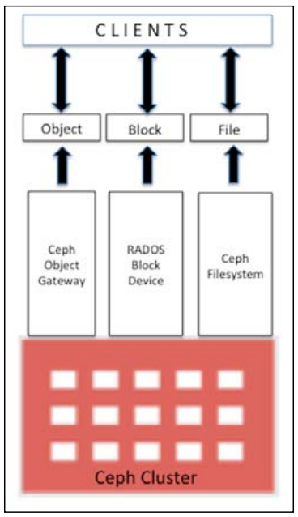
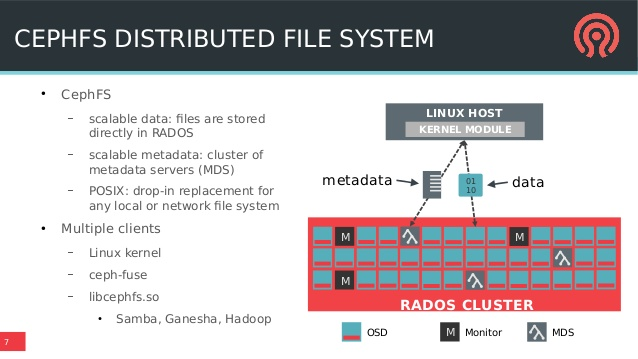
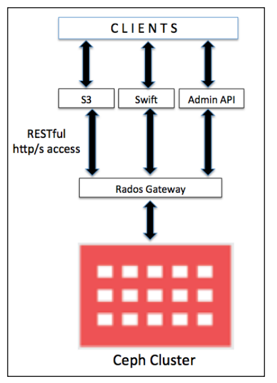

# Khả năng cung cấp storage - Ceph
---
## Giới thiệu
Cung cấp storage là tính năng chính và cũng là nhiệm vụ quan trọng của storage system administrator. Các dạng thường được sử dụng để cung cấp là blocks, files, or objects. Máy tính cá nhân và server bị giới hạn bởi khả năng lưu trữ thông thường.

=> Ceph cung cấp giải pháp storage hoàn thiện, cung cấp không giới hạn khả năng lưu trữ tới các server, cho phép lưu trữ số lượng ko hạn chế.

Ngoài việc cung cấp thêm dung lượng bộ nhớ, việc lưu trữ tập trung đem lại nhiều lợi ích.

Ceph cung cấp giải pháp thống nhất, bao gồm block storage, Fs, object storage. Dựa vào yêu cầu, ta có thể lựa chọn 1 hoặc nhiều giải pháp cung cấp bởi Ceph.

## Các giải pháp cung cấp bởi Ceph
### Ceph filesystem
Ceph filesystem được biết đến CephFS; nó là POSIX-compliant FS, sử dụng Ceph RADOS để lưu trữ data. Để thực hiện Ceph FS,  cần chạy thiết lập ít nhất 1 Ceph Metadata.

### RADOS block device (RBD)
Được biết đến = Ceph block device, cung cấp các ổ đĩa mở rộng. Client có thể sử dụng disk cung cấp linh hoạt. RADOS block device sử dụng librdb library và stores block data theo dạng nối tiếp hoặc phân chia trên các OSD trong Ceph cluster tùy theo thiết lập.

RBD sử dụng, hoặc nằm trên RADOS layer Ceph, vì vậy mỗi block device sẽ nằm trên nhiều Ceph node, cung cấp hiệu năng, tính bảo đảm cao.

> RBD is rich with enterprise features such as thin provisioning, dynamically resizable, snapshots, copy-on-write, and caching, among others.

RBD protocol hỗ trợ kerver driver, tương thích cao Linux, hỗ trợ các nền tảng ảo hóa như KVM, Qemu, and libvirt. Cho phép máy ảo sử dụng nhưng điểm mạnh của Ceph block device cũng như Ceph Storage.

### Object storage sử dụng Ceph RADOS gateway
Obj storage, như tên, chúng quản lý data = obj. Mỗi objet lưu data, metadata với định danh riêng. Các obj không thể truy cập trực tiếp với OS như những FS. Chúng chỉ có thể truy cập thông qua các API tại mức app lv. Ceph cung cấp obj storage interface ~ RADOS gateway, được xây dựng trên Ceph RADOS layer. RADOS gateway cung cấp RESTfil S3 hoặc Swift-compative API interface để lưu trữ data dạng obj trong Ceph cluster.

Trong môi trường production, nếu yêu cầu Ceph RADOS gateway thực hiện nhưng tác vụ năng, ta cần tách riêng node thành 1 máy chủ vật lý riêng. Khi cần tiết kiệm, ta có thể tích hợp nó với Ceph Monitor node.
