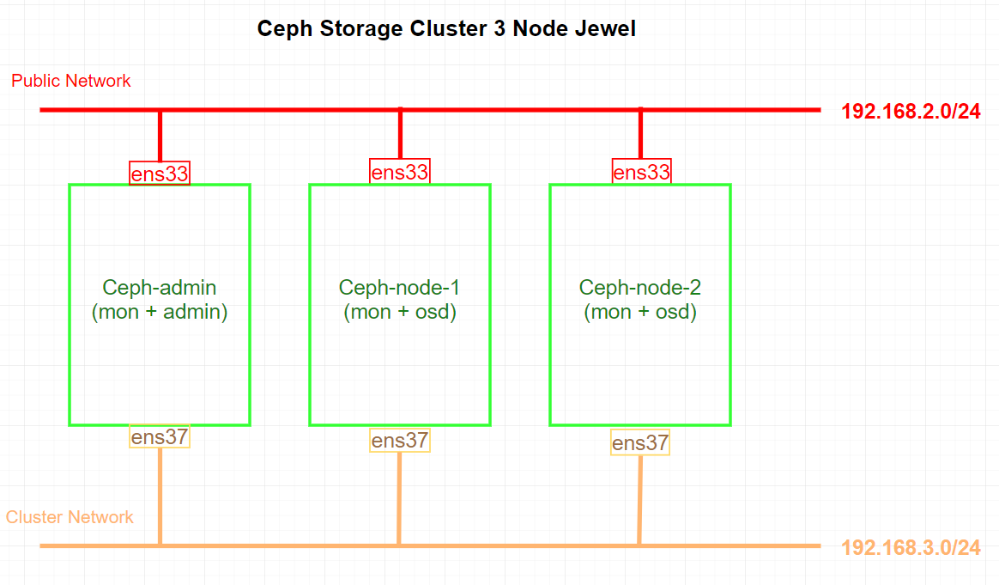
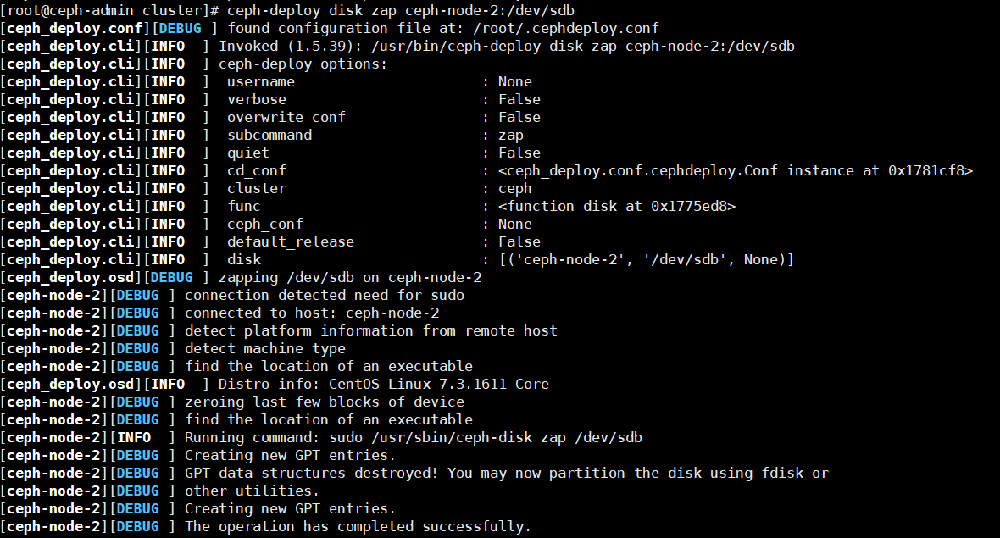
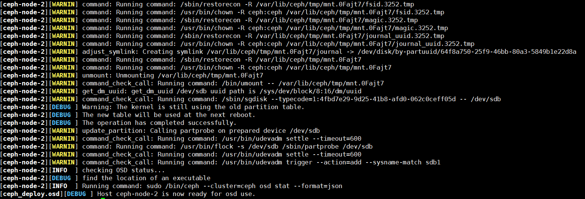
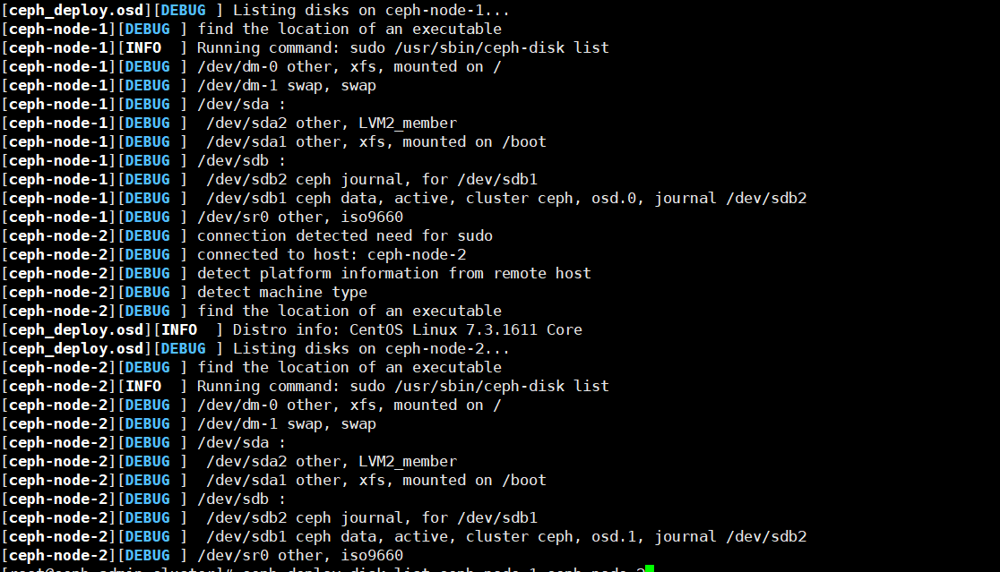
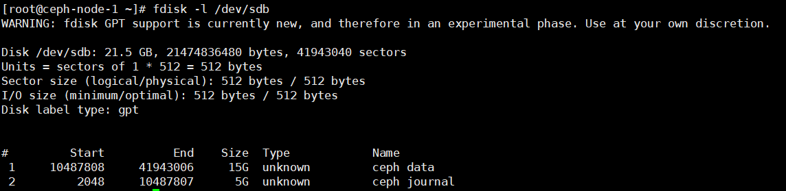
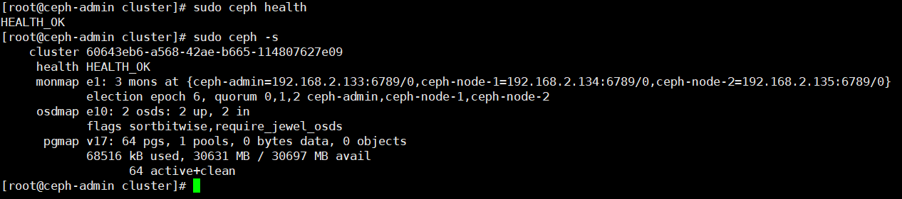
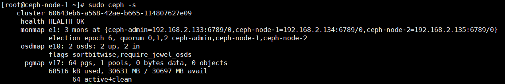

# Cài đặt Ceph Storage Cluster 3 Node Jewel - CentOS 7
---
## Chuẩn bị

### Sơ đồ

### Về tài nguyên

__Yêu cầu sử dụng 3 node, tất cả cài đặt CentOS 7__

| Tên node | Public Network | Cluster Network |
|---|---|---|
| ceph-admin | 192.168.2.133 | 192.168.3.128 |
| ceph-node-1 | 192.168.2.134 | 192.168.3.129 |
| ceph-node-2 | 192.168.2.135 | 192.168.3.130 |

> quyền root trên tất cả các node

### Cấu hình mỗi máy
#### __ceph-admin__
```
CPU:        2 core
RAM:        2 GB
Hard Disk:  50 GB
```

#### __ceph-node-1__
```
CPU:        2 core
RAM:        2 GB
Hard Disk:  50 GB
Hard Disk:  20 GB (Dùng cho Ceph Cluster)
```

#### __ceph-node-2__
```
CPU:        2 core
RAM:        2 GB
Hard Disk:  50 GB
Hard Disk:  20 GB (Dùng cho Ceph Cluster)
```

## Cài đặt
### Phần 1 - Cấu hình chuẩn bị trên tất cả các node
#### Bước 1: Tạo Ceph User
Tạo Ceph user 'cephuser' trên tất các các nodes.
```
useradd -d /home/cephuser -m cephuser
passwd cephuser
```
Cấp quyền root cho user vừa tạo
```
echo "cephuser ALL = (root) NOPASSWD:ALL" | sudo tee /etc/sudoers.d/cephuser
chmod 0440 /etc/sudoers.d/cephuser
sed -i s'/Defaults requiretty/#Defaults requiretty'/g /etc/sudoers
```
#### Bước 2: Cấu hình NTP
Sử dụng NTP đồng bộ thời gian trên tất cả các Node.
> Ở đây sử dụng NTP pool US.

```
yum install -y ntp ntpdate ntp-doc
ntpdate 0.us.pool.ntp.org
hwclock --systohc
systemctl enable ntpd.service
systemctl start ntpd.service
```

#### Bước 3 (Tùy chọn): Nếu chạy tất cả node trên VMware, cần sử dụng công cụ hỗ trợ
```
yum install -y open-vm-tools
```

#### Bước 4: Hủy bỏ SELinux
```
sed -i 's/SELINUX=enforcing/SELINUX=disabled/g' /etc/selinux/config
```

#### Bước 5: Cấu hình Host File
Cấu hình trên tất cả các node
```
vim /etc/hosts

# content
192.168.2.133 ceph-admin

192.168.2.134 ceph-node-1

192.168.2.135 ceph-node-2
```
> Ping thử tới các host, kiếm tra Network

> VD: ping -c ceph-node-1

### Phần 2: Cấu hình SSH Server
> __Cấu hình trên ceph-admin node__

Sẽ sử dụng admin node để cấu hình các node còn lại.

#### Bước 1: Truy cập ceph-admin
```
ssh root@ceph-admin
```
> Sử dụng admin node để cài đặt các node còn lại, vì vậy ceph-admin node cần có khả năng truy cập tới các node còn lại.

#### Bước 2: Tạo ssh-key
```
ssh-keygen
```
> Để khoảng trắng trên các lựa chọn


#### Bước 3: Cấu hình ssh file
```
vim ~/.ssh/config

# content

Host ceph-admin
        Hostname ceph-admin
        User cephuser

Host ceph-node-1
        Hostname ceph-node-1
        User cephuser

Host ceph-node-2
        Hostname ceph-node-2
        User cephuser
```
Thay đổi quyền trên file
```
chmod 644 ~/.ssh/config
```

Chuyển ssh-key tới các node còn lại
```
ssh-keyscan ceph-admin ceph-node-1 ceph-node-2 >> ~/.ssh/known_hosts
ssh-copy-id ceph-admin
ssh-copy-id ceph-node-1
ssh-copy-id ceph-node-2
```
> Yều cầu nhập passwd trong lần đầu tiền truy cập

### Phần 3: Cấu hình Firewalld
#### Tùy chọn 1: Cấu hình dựa theo lab
Trong lab ta sẽ bỏ qua cấu hình firewalld (cấu hình trên tất cả các node)
```
systemctl stop firewalld
systemctl disable firewalld
```

#### Tùy chọn 2: Cấu hình firewalld (Chưa kiểm chứng)
##### Xem thêm
[Cài đặt Ceph trên CentOS 7](ceph-install-lab.md)

### Phần 4: Thiết lập Ceph Cluster
Tại phân này, ta sẽ cài đặt tât cả các Ceph node thông qua ceph-admin node.

#### Bước 1: Truy cập ceph-admin node
```
ssh root@ceph-admin
```

#### Bước 2: Cài đặt ceph-deploy trên ceph-admin node
Thêm Ceph repo và cài đặt gói thiết lập Ceph với yum cmd
```
sudo rpm -Uhv http://download.ceph.com/rpm-jewel/el7/noarch/ceph-release-1-1.el7.noarch.rpm
sudo yum update -y && sudo yum install ceph-deploy -y
```

#### Bước 3: Tạo mới Ceph Cluster config
Tạo cluster directory
```
mkdir cluster
cd cluster/
```

Tạo mới cluster config với 'ceph-deploy' command, thiết lập monitor node = 'ceph-admin'
```
ceph-deploy new ceph-admin
```

Cấu hình ceph.conf
```
vim ceph.conf

# Content (Sửa lại theo lab)
[global]
fsid = 60643eb6-a568-42ae-b665-114807627e09
auth_cluster_required = cephx
auth_service_required = cephx
auth_client_required = cephx
osd pool default size = 2

# Cấu hình Network
public network = 192.168.2.0/24
cluster network = 192.168.3.0/24

# Cấu hình monitor node
[mon]
mon host = ceph-admin, ceph-node-1, ceph-node-2
mon initial members = ceph-admin, ceph-node-1, ceph-node-2

[mon.ceph-admin]
host = ceph-admin
mon addr = 192.168.2.133

[mon.ceph-node-1]
host = ceph-node-1
mon addr = 192.168.2.134

[mon.ceph-node-2]
host = ceph-node-2
mon addr = 192.168.2.135
```

#### Bước 4: Cài đặt Ceph tới tất cả các node
Cài đặt Ceph tới tất cả các node từ ceph-admin node.
```
ceph-deploy install ceph-admin ceph-node-1 ceph-node-2
```
> cmd sẽ tự động cài đặt ceph tới tất cả các node: mon1, osd1-2 và ceph-amdin

Thiết lập ceph-mon tới mon1 node
```
ceph-deploy mon create-initial
```

#### Bước 5: Thêm OSD tới Cluster
Sau khi Ceph được cài đặt tới các node, ta cần thêm tiến trình OSD tới cluster. Các tiến trình OSD sẽ tạo data, journal partition trên disk /dev/sdb.
```
ceph-deploy disk list ceph-node-1 ceph-node-2
```


Xóa /dev/sdb partition tables trên tất cả node với zap option
```
ceph-deploy disk zap ceph-node-1:/dev/sdb
ceph-deploy disk zap ceph-node-2:/dev/sdb
```
> cmd trên sẽ xóa toàn bộ data trên /dev/sdb tại Ceph OSD node



Thiết lập OSD node
```
ceph-deploy osd prepare ceph-node-1:/dev/sdb ceph-node-2:/dev/sdb
```



Kích hoạt OSD
```
ceph-deploy osd activate ceph-node-1:/dev/sdb1 ceph-node-2:/dev/sdb1
```



Theo kết quả, /dev/sdb sẽ có 2 phân vùng
- /dev/sdb1 - Ceph Data
- /dev/sdb2 - Ceph Journal

Kiểm tra tại OSD node
```
fdisk -l /dev/sdb
```



Thiết lập management-key liên kết các node
```
ceph-deploy admin ceph-admin ceph-node-1 ceph-node-2
```

Thiết lập quyền truy cập file trên tất cả các node
```
sudo chmod 644 /etc/ceph/ceph.client.admin.keyring
```

> Sau bước trên thiết lập Ceph Cluster hoàn tất

### Phần 6: Kiểm tra Ceph setup
#### Kiểm tra tại 1 trong các Ceph monitor node
Truy cập 1 trong các ceph monitor
```
ssh root@ceph-admin
```

Kiểm tra cluster health
```
sudo ceph health
```
Kiểm tra cluster status
```
sudo ceph -s
```



#### Tại node khác (__ceph-node-1__)

