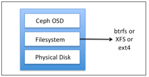
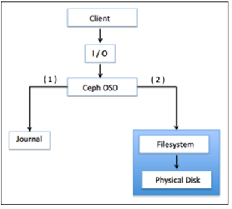
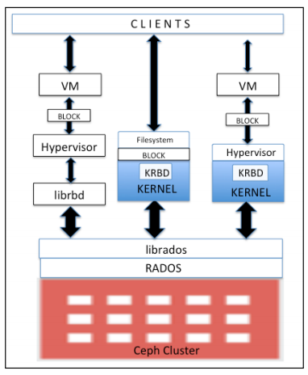
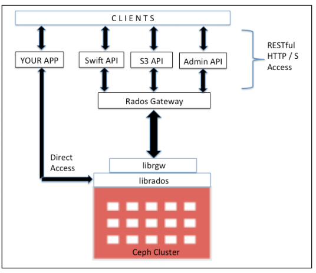
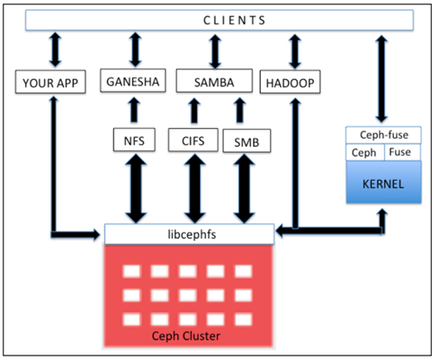

# Ceph - Phần 2: Kiến trúc và các thành phần Ceph
---
## Ceph storage architecture
Ceph storage cluster xây dựng từ 1 vài software daemons. Mỗi tiền trình đều có vài trò riêng trong tính năng của Ceph và có những giá trị đặc biệt tương ứng. Đây là yếu tố góp phần giảm giá thành khi so sánh Ceph với các hệ thống tương tự.

### Kiến trúc Ceph

#### __Reliable Autonomic Distributed Object Store (RADOS)__

Yếu tổ nền tảng tạo nên Ceph storage cluster. Ceph data được lưu trên object, RADOS obj chịu trách nhiệm lưu trữ, bất kể loại dữ liệu.

RADOS layer chắc chắn data sẽ luôn chính xác, bảo đảm. Về tính nhất quán, nó sẽ được nhân bản, phát hiện lỗi, khôi phục trên mọi node trong cluster.

Khi app lưu trữ tới Ceph cluster, data sẽ được lưu tại Ceph Object Storage Device (OSD) dưới dạng object. Đây là thành phần duy nhất mà Ceph cluster sử dụng để lữu trữ data và lấy lại. Thông thường, tổng số physical disk trong Ceph cluster sẽ = số lương OSD daemon chạy lưu trữ data tới mỗi disk.

#### __Ceph monitors (MONs)__
Thành phần tập trung vào trạng thái toàn cluster, giám sát trạng thái OSD, MON, PG, CRUSH map. Các cluster nodes sẽ giám sát, chia sẽ thông tin về nhưng thay đổi. Quá trình giám sát sẽ không lưu trữ data (công việc OSD).

librados lib hỗ trợ truy cập RADOS thông qua PHP, Ruby, Java, Py, C/++. Cung cấp giao diện thân thiện tới Ceph storage cluster, RADOS và các service RBD, RGW, POSIX interface trong CephFS.

> The librados API supports direct access to RADOS and enables you to create your own interface to the Ceph storage cluster.

#### __Ceph Block Device hay RADOS block device (RBD)__
Thành phần cung cấp block storage, có thể mapped, formmatted, mounted như bất kỳ disk thông thường. Ceph block device hỗ trợ các tính năng provisioning và snapshots (chức năng cần thiết cho doanh nghiệp).

#### __Ceph Object Gateway hay RADOS gateway (RGW)__
Thành phần cung cấp giao diện RESTful API, tương thích với Amazone S3 (Simple Storage Service) và OpenStack Object Storage API (Swift). RGW cũng hỗ trợ OpenStack Keystone authentication services.

#### __Ceph Metadata Server (MDS)__
Thành phần tập trung vào phân cấp file và lưu trữ metadata dành riêng cho CephFS. Ceph block device và RADOS gateway không yêu cầu metadata vì chúng không cần Ceph MDS daemon. MDS không trực tiếp hỗ trợ khách hàng, vì thế loại bỏ tính lỗi đơn cho hệ thống.

#### __Ceph File System (CephFS)__
Thành phần cung cấp POSIX-compliant, phân phối filesystem cho mọi kiểu. CephFS dựa trên Ceph MDS để thể hiện tính phân cấp file, metadata.

## Ceph RADOS
__RADOS (Reliable Autonomic Distributed Object Store)__ là trung tâm của Ceph storage system, cũng được gọi là __Ceph Storage Cluster__.

__RADOS__ cung cấp rất nhiều tính năng quan trọng cho Ceph, bao gồm phân bố lưu trữ đối tượng, HA, bảo đảm, chịu lỗi, tự xử lý, tự giám sát. Vì vậy, RADOS layer cực kỳ quan trọng trong kiến trúc Ceph storage. Tất cả các phương thức truy cập vd: RBD, CephFS, RADOSGW, librados đều hoạt động trên RADOS layer.

Khi Ceph Cluster nhận yêu cầu ghi từ client, thuật toán CRUSH sẽ tính toán vị trị data sẽ được lưu. Thông tin này sau đó sẽ được gửi tới RADOS layer cho việc xử lý sau. Dựa trên tập rule CRUSH, RADOS phân bố data trên tất cả cluster node và trong nhưng đối tượng nhỏ. Cuối cùng obj được lưu trên OSDs.

__RADOS__ sẽ chịu trách nhiệm giữ data bảo đảm khi cấu hình và nhân bản factor nhiều hơn 1 lần. Tại cùng thời điểm, nó sẽ nhân bản object, tạo bảo sao, lưu trữ tại phân vùng khác. Tuy nhiên, để tùy chỉnh và có mức bảo đảm cao hơn, ta cần tuy chỉnh CRUSH ruleset theo yêu cầu và hạ tầng. RADOS bảo đảm sẽ luôn có nhiều hơn 1 bản sao lưu trên RADOS cluster.

Bên cạnh lưu và nhân bản object tới các cluster, RADOS sẽ bảo đảm trạng thái obj phù hợp. Trong trường hợp sai khác, sẽ khôi phục obj dựa trên các bản sao. Tính năng khôi phục chạy tự động vì Ceph có 2 cơ chế tự quản trị, tự sửa lỗi.

Khi nhìn vào kiến trúc Ceph, ta sẽ thầy nó gồm 2 phần, RADOS là tầng dưới, nằm trong Ceph cluster, không giao triếp trực tiếp với client, bên trên sẽ có client interface.

### Ceph Object Storage Device (OSD)
1 trong những thành phần quan trọng khi xây dựng blocks trong Ceph storage cluster. Nó lưu trữ data thực sự trên physical disk drives tại mỗi cluster node dạng obj. Phần lớn hoạt động bên trong Ceph Cluster được thực hiện bởi tiến trình Ceph OSD.

__Ceph OSD__ lưu tất cả client data dạng obj, đáp ứng yêu cầu yêu cầu đến data được lưu trữ. Ceph cluster bao gồm nhiều OSD. Trên mỗi hoạt động đọc và ghi, client request tới cluster maps từ monitors, sau đó, họ sẽ tương tác với OSDs với hoạt động đọc ghi, không có sự can thiệp monitors. Điều này kiến tiến trình xử lý dữ liệu nhanh hơn khi ghi tới OSD, lưu trữ data trực tiếp mà không thông qua các lớp xử lý data khác. Cơ chế __data-storage-and-retrieval mechanism__ gần như độc nhật khi so sánh ceph với các công cụ khác.

Tính năng cơ sở của Ceph bao gồm reliability, rebalancing, recovery, consistency tới từ các OSD. Dựa trêm cấu hình replication size, Ceph cung cấp sự bảo đảm bằng cách nhân bản mỗi obj tới các cluster node, khiến obj có tính HA và có thể chịu lỗi. Mỗi Obj trong OSD đều có phiển bản chính và các bản sao nằm trên các OSD khác. Vì Ceph lưu trữ phân tán nên các obj được lưu trữ trên nhiều OSD, mỗi OSD sẽ chứa 1 số phiển bản chính của Obj và bản phụ 1 số obj khác.

Khi sảy ra lỗi disk, Ceph OSD daemon sẽ so sánh các OSD để bắt đầu hoạt động khôi phục. Trong thời điểm, OSD lưu trữ bản sao sẽ trở thành bản chính, và tạo bản sao mới tới OSD khác trong thời điểm khôi phục. Cơ bản Ceph cluster sẽ tạo 1 OSD daemon cho mỗi disk trong cluster. Tuy nhiên OSD hỗ trợ tùy trỉnh, cho phép 1 OSD per host, disk, raid volume. Hầu hết khi triển khai Ceph trong JBOD environment sẽ sử dụng mỗi OSD daemon trên mỗi disk vật lý.

### Ceph OSD filesystem
Ceph OSD bao gồm Ceph OSD filesystem, Linux filesystem nằm phía trên và Ceph OSD service. Linux filesystem góp phần quan trọng tới Ceph OSD daemon như hỗ trợ __extended attributes (XATTRs)__. __filesystems' extended attributes__ cung cấp các thông tin nội bộ về obj state, snap shot, metadata, ACL tới OSD daemon, cho phép quản trị data.

Hoạt động Ceph OSD bên trên physical disk drive có phân vùng trong Linux partition. Linux partition có thể là Btrfs (B-tree file system), XFS, or ext4. Việc lựa chọn filesystem góp phần lớn trong việc tính toán hiệu năng trên Ceph Cluster, mỗi file system đều có đặc điểm riêng.

- Btrfs: OSD với Btrfs filesystem, cung cấp hiệu năng tốt nhất khi so sánh với XFS, ext4. Điểm mạnh khi sử dụng Btrfs là nó hỗ trợ  copy-on-write, writable snapshots hỗ trợ các VM provisioning and cloning. Đồng thời, nó hỗ trợ transparent compression (nén ..), pervasive checksums (kiểm tra), và incorporates multidevice management (quản lý ..) trong fs. Btrfs hỗ trợ hiệu quả XATTRs, inline data cho nhưng file nhỏ, provides integrated volume management như SSD aware, and has the demanding feature of online fsck. However, despite these new features, Btrfs is currently not production ready, but it's a good candidate for test deployment.

- XFS: Tin cậy, rõ ràng, fs ổn định vững chắc. Được khuyên dùng cho hệ thống XFS Ceph Cluster và được sử dụng nhiều nhất trên Ceph storage và khuyển dùng cho mỗi OSDs. Tồn tại 1 số đặc điểm kém Btfs. Tồn tạt 1 số vần đề về hiệu suất khi mở rộng metadata. XFS là journaling filesystem, vì thế, mỗi khi client gửi data to write tới Ceph cluster, đầu tiên nó sẽ ghi vào journaling space sau đó mới là XFS file system. Điều này làm tăng chi phi về data cung như kiến XFS chạy chậm hơn Btrfs.
- Ext4: fourth extended filesystem, hỗ trợ journaling filesystem, hỗ trợ tốt Ceph OSD; Tuy nhiên nó không thân thiện = XFS. Từ góc độ hiệu năng, ext4 chưa bằng Btrfs.

Ceph OSD sử dụng các thuộc tính mở rộng của FS để biết trạng thái obj nội bộ và metadata. XATTRs cho phép lưu thông tin mở rộng liên quan tới object dạng xattr_name và xattr_value, cung cấp tagging objects with more metadata information. The ext4 filesystem không cung cấp đủ tính năng XATTRs dẫn đến 1 số hạn chế về số lượng bytes lưu trữ XATTRs, vì thế kiếm ext4 không thân thiện khi lựa chọn fs. Đồng thời Btrfs and XFS hỗ trợ khả năng lưu trữ lớn hơn so với XATTRs.

#### __Ceph OSD journal__
Ceph sử dụng journaling filesystems như Btrfs, XFS cho OSD. Trước khi đẩy data tới backing store, Ceph ghi data tới 1 phân vùng đặc biệt gọi journal. Nó là small buffer-sized partition cách biệt với spinning disk as OSD hoặc trên SSD disk or partition hoặc là 1 file trên fs. Trong kỹ thuật, Ceph ghi tất cả tới jounal, sau đó mới lưu trừ tới backing storage.

10gb là size cơ bản của journal, có thể to hơn tùy vào partition. Ceph sử dụng journals để tăng tốc độ và tăng tính bảo đảm. Journal cho phép Ceph OSD thực hiện công việc lưu trư nhanh hơn; random write được ghi trên sequential pattern on journals, sau đó đẩy sang FS. Điều này kiến filesystem có đủ thời gian để kết hợp ghi xuống disk. Hiệu suất được cải thiện khi journal được thiết lập trên SSD disk partition. Theo kịch bản, tất cả client sẽ được ghi rất nhanh trên SSD journal sau đó đẩy xuống đĩa quay.

Sử dụng SSD như journals cho phép OSD xử lý được 1 khối lượng công việc lớn. Tùy nhiên nếu journals chậm hơn backing store, nó sẽ hạn chế hiệu năng của cluster. Vì thế theo yêu cầu, không vượt quá tỷ lệ 4-5 OSDs trên mỗi journal disk khi sử dụng SSDs mở rộng cho journals. Vượt quá OSD trên mỗi journal disk có thể tạo hiện tượng nghẽn cổ trai cho cluster.

Trong trường hợp lỗi journal trong Btrfs-based filesystem, nó sẽ giảm thiểu mất mát dữ liệu. Btrfs sử dụng kỹ thuật copyon-write filesystem, vì thế nếu nội dung content block thay đổi, việc ghi sẽ diễn ra riêng biệt. Trong trường hợp journal gặp lỗi, data sẽ vẫn tồn tại.

Không sử dụng RAID cho ceph vì:
+ Chạy RAID và nhân bản trên raid làm giảm hiệu năng cũng như ổ cứng khiến việc nhân bản diễn ra gắp 2 lần và chiếm nhiều tài nguyên. Vì thế nếu cấu hình RAID, khuyển dụng sử dụng RAID 0.
+ Bảo vệ data, Ceph sẽ chịu trách nhiệm nhân bản, tái tạo data thay vì RAID, Ceph vượt trội so với RAID truyền thống, nhanh chóng khôi phục giảm tốn kém phần cứng
+ Hiệu năng Ceph sẽ giảm xuống khi sử dụng RAID 5 6 vì tính chất random IO

### __Ceph monitors__
Ceph monitor chịu trách nhiệm giám sát toàn cluster. Tiến trình này chạy trên toàn cluster, giám sát dựa trên thông tin storing critical cluster, state of peer nodes, and cluster configuration information. Ceph monitor thực hiện nhiệm vụ = cách duy trì master copy trên cluster. Cluster map bao gồm OSD, PG, CRUSH, MDS maps.

Tất cả map được biết đến cluster map:
+ Monitor map: Chưa thông tin về monitor node, bao gồm Ceph cluster IP, monitor hostname, and IP address with port number. Nó cũng lưu trữ map creation và thông tin thay đổi cuối cùng.
+ OSD map: Lưu 1 số thông tin như cluster IP, sự tạo thành OSD map, thay đổi cuối cùng, 1 số thông tin khác như pool names, pool ID, type, replication level, and placement groups. Nó cũng lưu thông tin OSD như count, state, weight, last clean interval, and OSD host information.
+ PG map: Thông tin về group version, time stamp, last OSD map epoch, full ratio ratio information. Các thông tin về group ID, object count, state, state stamp, up and acting OSD sets, and finally, the scrub details.
+ CRUSH map: giữa thông tin về  cluster's storage devices, failure domain hierarchy, rules defined for the failure domain when storing data.
+ MDS map: Lưu thông tin về MDS map, map creation, modification timedata and metadata pool ID, cluster MDS count, and MDS state.

Ceph monitor không lưu data và phục vụ user. Nó sẽ tập trung vào update cluster map tới client và cluster node. Client và cluster node kiểm tra theo chu kỳ.

Tiến trình giám sát rất nhẹ, nó sẽ ko ảnh hướng tới tài nguyên có sẵn cua server. monitor node cần có đủ dung lương đễ lưu trữ cluster log bao gồm OSD, MDS và monitor logs.

Ceph cluster bao gồm nhiều hơn 1 monitor node. Kiến trúc Ceph được thiết kế quorum and provides consensus khi đưa ra quyết định phân tán cluster bằng thuật toán Paxos. Monitor count trong cluster là 1 số lẻ, tối thiểu 1 – 3. Trong tất cả các cluster monitor, sẽ có 1 hoạt đông như leader. Phiển bản thương mại cần ít nhất 3 monitor node cho HA

> Tùy thuộc vào tùi tiền, tiền trình monitor có thể chạy trên cùng OSD node. Tuy nhiên sẽ cần nhiều CPU, RAM, disk cho việc lưu trữ log.

#### __Librados__
Là thư viên C, cho phép app làm việc với RADOS, bỏ qua 1 số interface layer để tương tác với Ceph cluster. Librados là thư viện cho RADOS, cung cấp nhiều API, ủy quyền app trực tiếp, truy cập song song tới clusters, with no HTTP overhead. App có thể mở rộng các giao thức = truy cập tơi RADOS. Thư viện hỗ trợ C++, Java, Python, Ruby, and PHP. librados serves as the base for other service interfaces that are built on top of the librados native interface, which includes the Ceph block device, Ceph filesystem, and Ceph RADOS gateway. librados cung cấp nhiều API subsets, efficiently storing key/value inside an object.

> API supports atomic-single-object transaction by updating data, key, and attributes together. Interclient communication is supported via objects.

Tương tác trực tiếp với RADOS cluster vơi  librados library nâng cao performance, reliability, efficienc. Hỗ trợ cho Platform-as-a-Service và Software-as-a-Service cloud solutions

### __Ceph block storage__
1 trong nhưng thành phần quan trọng sử dụng cho định dang dữ liệu trong mỗi trường doanh nghiệp. Ceph block device = RADOS block device (RBD); cung cấp block storage solutions tới physical hypervisors cung cấp cho virtual machines. Ceph RBD driver được tích hợp với Linux mainline kernel và hỗ trợ QEMU/KVM, cho phép Ceph block device seamlessly.

Linux host hỗ trợ đầy đủ Kernel RBD (KRBD) và maps Ceph block devices sử dụng librados. RADOS sau đó lưu trữ Ceph block device objects across clusters in a distributed pattern. Khi Ceph block device được map Linux host, nó có thể sử dụng như 1 phần vùng RAW hoặc labelled với filesystem followed by mounting.

RDB sử dụng librbd libraries để tần dụng lợi ích RADOS, cung cấp tính bảo đảo, phân tán, object-based block storage. Khi client ghi tới RDB, librbd libraries map data block tới object lưu trong CephCluster, chia data obj, nhân bản tới cluster, nâng cao bảo đảm, tin cậy, hiệu năng. RBD phía trên RADOS layer hỗ trợ update trực tiếp tới obj. Client có thể ghi, thêm, cắt trên obj tồn tại. Khiển RBD tối ưu giải pháp virtual machine volumes và frequent writes to their virtual disks.

Ceph RBD có đầu đủ sức mạnh của SAN storage, cung cấp giải pháp mức doanh nghiệp với tính năng thin provisioning, copy-on-write snapshots and clones, revertible read-only snapshots, hỗ trợ cloud platforms như OpenStack và CloudStack.

### __Ceph Object Gateway__
Ceph Obj Gateway hay RADOS gateway, là proxy chuyển đổi HTTP requests thành RADOS requests và ngược lại, cung cấp RESTful object storage, tương thích S3, Swift. Ceph Object Storage sử dụng Ceph Object Gateway daemon (radosgw) để tương tác librgw và Ceph Cluster, librados. Nó thực thi FastCGI module sử dụng libfcgi và có thể sử dụng FastCGI-capable web server.

Ceph Object Store hỗ trợ 3 giao diện:
+ S3 compatible:
+ Swift compatible
+ Admin API

Ceph Object Gateway có user quản tri riêng. Cả S3 và Swift API chia sẻ phần chung bên trong Ceph Cluster, vì thế có thể write data từ 1 API và lấy từ data từ 1 data khác. Để tăng tốc xử lý, nó sử dụng memory để cache metadata. Ta có thể sử dụng nhiều hơn 1 gateway và giữ chúng bên dưới load balancer để thực hiện quản lý load. Hiệu năng sẽ cải thiện khi chia nhỏ REST object thành smaller  RADOS objects. Bên cạnh S3 và Swift API, app có thể bỏ qua RADOS gateway, sử dụng trực tiếp thông quan librados.

## Ceph MDS
Ceph MDS tập trung vào Metadata Server và yêu cầu riêng cho CephFS, và 1 số storage methods block; object-based storage không yêu cầu MDS services. Ceph MDS hoạt động như 1 tiền trình, cho phép client mount POSIX file system với bất kỳ size. MDS không phục vụ data trực tiếp tới client; data được phục vụ bởi OSD. MDS cung cấp hệ thống chia sẽ tệp liên tục với smart caching layer. Vì thế giảm quá trình read write. MDS mở rộng lợi ích về chia nhỏ phân vùng, single MDS cho 1 phần metadata.

MDS không lưu trữ local data, ít cần thiết trong 1 số kịch bản. Nếu tiến trình MDS lỗi, ta có thể chạy lại thông qua truy cập cluster. Tiền trình metadata server được cấu hình chủ động hoặc bị động. Node MDS chính sẽ trở thành active, phần còn lại sẽ chuyển sang chế độ chờ. Khi xảy ra lỗi primary MDS, node tiếp theo sẽ thay đổi trạng thái. Để nhanh chong khôi phục, ta có thể chỉ định node nào sẽ trở thành active node, đồng thời lưu trữ data giống nhau trong memory, chuẩn bị trước cho cache.

## Ceph filesystem
CephFS cung cấp POSIX-compliant filesystem nằm trên RADOS. Nó sử dụng tiến trình MDS để quản trị metadata, tách biệt metadata khởi data, giảm phức tạp, nâng cao tính bảo đảm. CephFS thừa hương 1 số tính năng từ RADOS và cung cấp tính năng cân bằng động cho data.

__libcephfs libraries__ nắm vai trò quan trọng, hỗ trợ thực thi client. Tương thích tốt với Linux kernel driver, vì thế client có thể sử dụng filesystem để mount thông qua mount cmd. Nó tương thích với SAMBA, hỗ trợ CIFS và SMB. CephFS mở rộng hỗ trợ file systems trong user space (FUSE) thông quan cephfuse modules. Nó cũng cho phép app tương tác trực tiếp, với RADOS cluster sẽ sử dụng libcephfs libraries.
