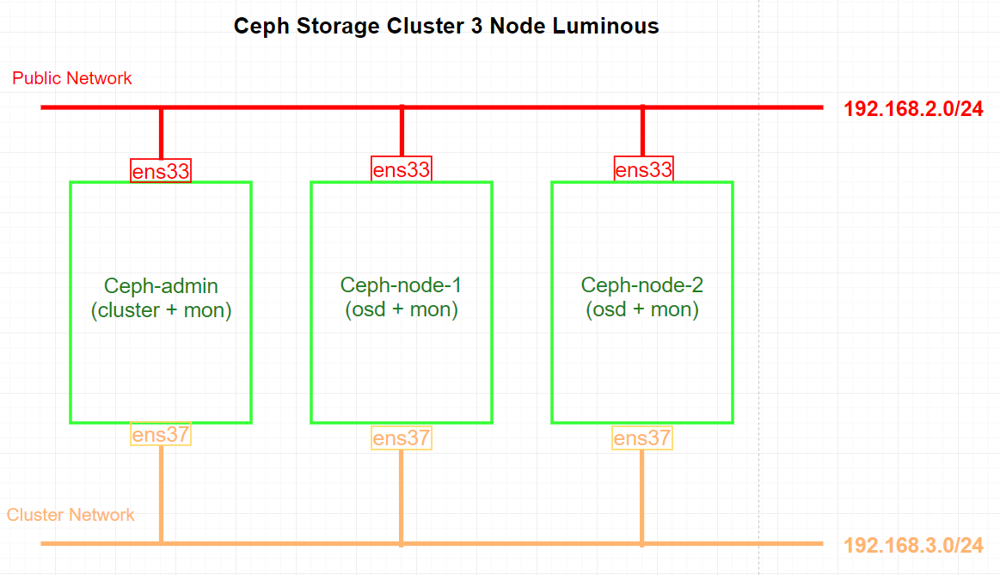
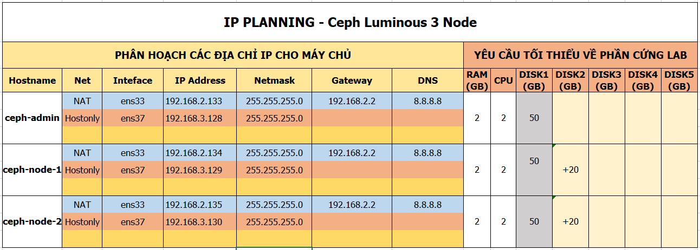
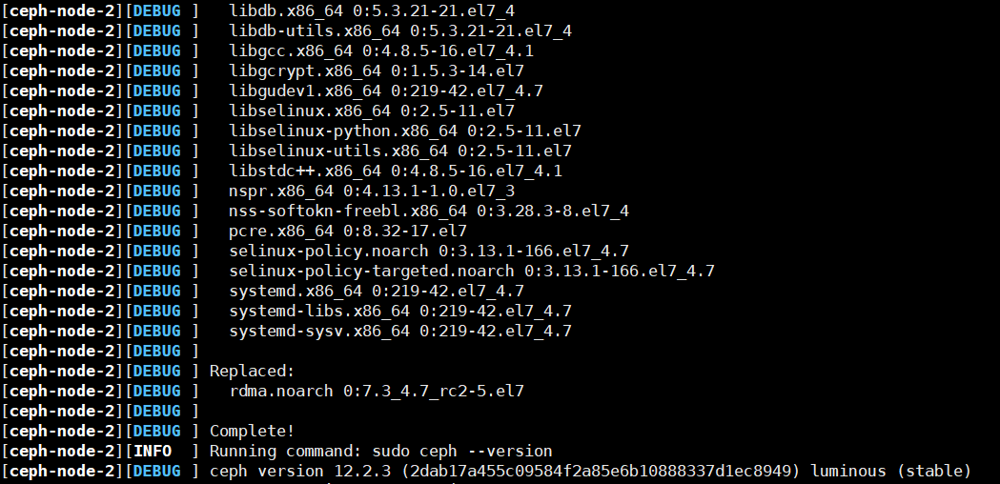
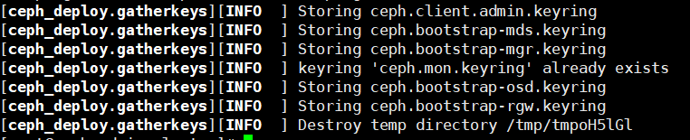
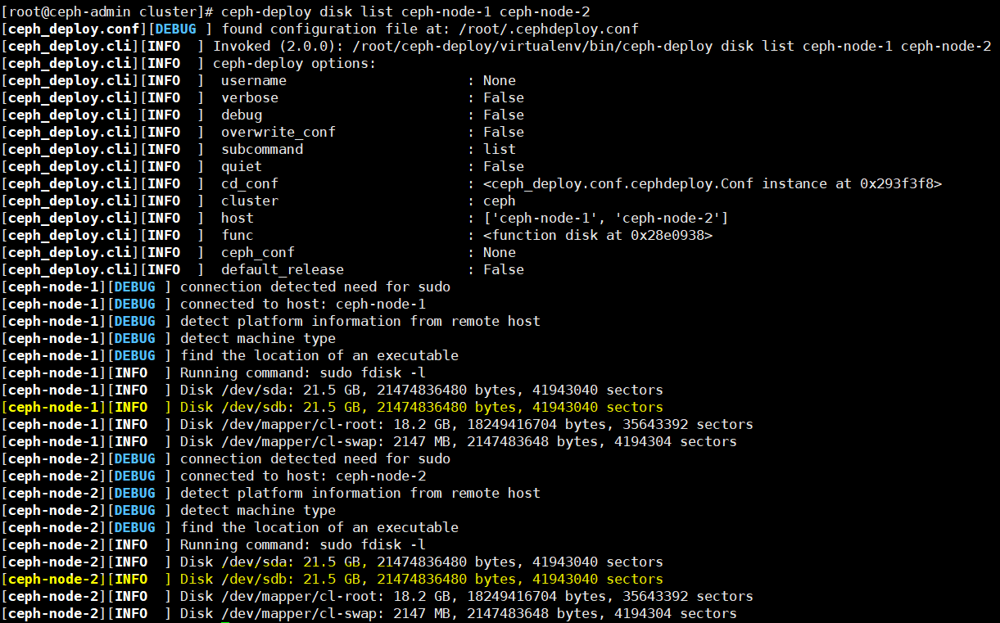
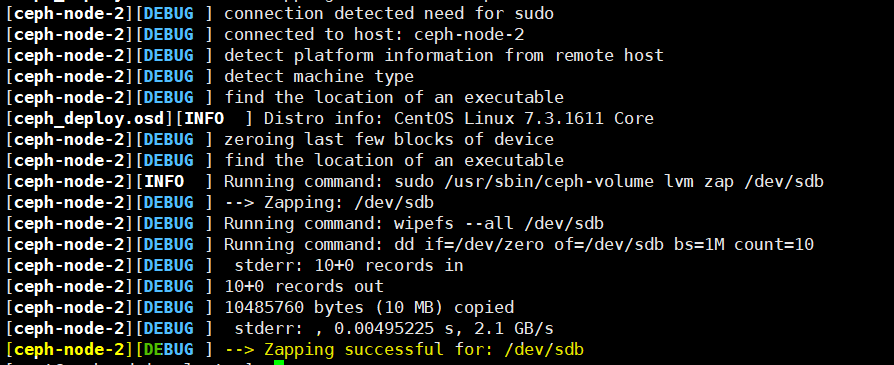
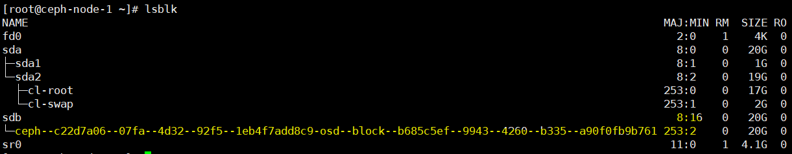
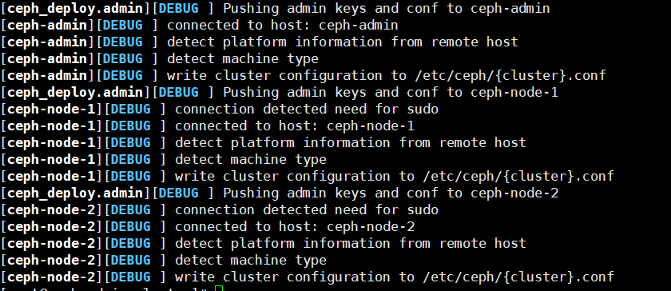
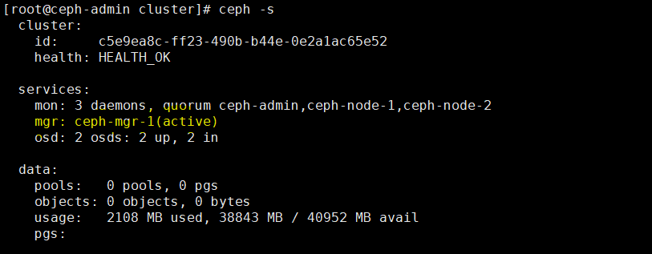

# Cài đặt Ceph Storage Cluster 3 Node luminous - CentOS 7
---
## Chuẩn bị

### Sơ đồ


### Về tài nguyên



## Cài đặt
### Phần 1 - Chuẩn bị môi trường
> `Lưu ý node thực hiện`
#### Bước 1: Cấu hình IP tĩnh trên tất cả các node
- Tại `ceph-admin`
  ```
  # Ceph admin
  echo "Setup IP ens33"
  nmcli c modify ens33 ipv4.addresses 192.168.2.133/24
  nmcli c modify ens33 ipv4.gateway 192.168.2.2
  nmcli c modify ens33 ipv4.dns 8.8.8.8
  nmcli c modify ens33 ipv4.method manual
  nmcli con mod ens33 connection.autoconnect yes
  
  echo "Setup IP ens37"
  nmcli c modify ens37 ipv4.addresses 192.168.3.128/24
  nmcli c modify ens37 ipv4.method manual
  nmcli con mod ens37 connection.autoconnect yes

  systemctl stop firewalld
  systemctl disable firewalld
  ```
- Tại `ceph-node-1`
  ```
  echo "Setup IP ens33"
  nmcli c modify ens33 ipv4.addresses 192.168.2.134/24
  nmcli c modify ens33 ipv4.gateway 192.168.2.2
  nmcli c modify ens33 ipv4.dns 8.8.8.8
  nmcli c modify ens33 ipv4.method manual
  nmcli con mod ens33 connection.autoconnect yes
  
  echo "Setup IP ens37"
  nmcli c modify ens37 ipv4.addresses 192.168.3.129/24
  nmcli c modify ens37 ipv4.method manual
  nmcli con mod ens37 connection.autoconnect yes
  
  systemctl stop firewalld
  systemctl disable firewalld
  ```
- Tại `ceph-node-2`
  ```  
  echo "Setup IP ens33"
  nmcli c modify ens33 ipv4.addresses 192.168.2.135/24
  nmcli c modify ens33 ipv4.gateway 192.168.2.2
  nmcli c modify ens33 ipv4.dns 8.8.8.8
  nmcli c modify ens33 ipv4.method manual
  nmcli con mod ens33 connection.autoconnect yes
  
  echo "Setup IP ens37"
  nmcli c modify ens37 ipv4.addresses 192.168.3.130/24
  nmcli c modify ens37 ipv4.method manual
  nmcli con mod ens37 connection.autoconnect yes

  systemctl stop firewalld
  systemctl disable firewalld
  ```

#### Bước 2: Tạo Ceph User
> Thực hiện trên tất cả các node CEPH
- Tạo user `cephuser`
  ```
  useradd -d /home/cephuser -m cephuser
  passwd cephuser
  ```
- Cấp quyền root cho `cephuser`
  ```
  echo "cephuser ALL = (root) NOPASSWD:ALL" | sudo tee /etc/sudoers.d/cephuser
  chmod 0440 /etc/sudoers.d/cephuser
  ```
#### Bước 3: Cấu hình NTP
> Thực hiện trên tất cả các NODE

> Cấu hình đồng bộ thời gian bằng NTP

> Sử dụng pool US.

```
yum install -y ntp ntpdate ntp-doc
ntpdate 0.us.pool.ntp.org
hwclock --systohc
systemctl enable ntpd.service
systemctl start ntpd.service
```

#### Bước 4 (Tùy chọn): Nếu ảo hóa bằng VMware, thực hiện
> Cấu hình trên tất cả các node
```
yum install -y open-vm-tools
```

#### Bước 5: Hủy bỏ SELinux
> Cấu hình trên tất cả các node
```
sed -i 's/SELINUX=enforcing/SELINUX=disabled/g' /etc/selinux/config
```

#### Bước 6: Cấu hình Host File
> Cấu hình trên tất cả các node
```
echo '
# config host
192.168.2.133 ceph-admin

192.168.2.134 ceph-node-1

192.168.2.135 ceph-node-2' >> /etc/hosts
```
> Kiểm tra ping để chắc chắn

### Phần 2: Cấu hình SSH Server
> Cấu hình trên node `ceph-admin`

> Sử dụng node `ceph-admin` cài đặt các node còn lại (qua SSH), vì vậy `ceph-admin` cần có khả năng truy cập tới các node còn lại.

#### Bước 1: Tạo ssh-key
```
echo -e "\n" | ssh-keygen -t rsa -N ""
```

#### Bước 2: Cấu hình SSH File
- Tạo file
  ```
  echo '
  Host ceph-admin
          Hostname ceph-admin
          User cephuser

  Host ceph-node-1
          Hostname ceph-node-1
          User cephuser

  Host ceph-node-2
          Hostname ceph-node-2
          User cephuser' >> ~/.ssh/config
  ```
- Thay đổi quyền trên file
  ```
  chmod 644 ~/.ssh/config
  ```
- Chuyển ssh-key tới các node client
  ```
  ssh-keyscan ceph-admin ceph-node-1 ceph-node-2 >> ~/.ssh/known_hosts
  ssh-copy-id ceph-admin
  ssh-copy-id ceph-node-1
  ssh-copy-id ceph-node-2
  ```

> Yều cầu nhập password trong lần đầu tiền truy cập

### Phần 3: Triển khai Ceph Cluster
> Thực hiện trên node `ceph-admin`

#### Bước 1: Thêm Repo
```
echo '
[Ceph]
name=Ceph packages for $basearch
baseurl=http://download.ceph.com/rpm-luminous/el7/$basearch
enabled=1
gpgcheck=1
type=rpm-md
gpgkey=https://download.ceph.com/keys/release.asc
priority=1

[Ceph-noarch]
name=Ceph noarch packages
baseurl=http://download.ceph.com/rpm-luminous/el7/noarch
enabled=1
gpgcheck=1
type=rpm-md
gpgkey=https://download.ceph.com/keys/release.asc
priority=1

[ceph-source]
name=Ceph source packages
baseurl=http://download.ceph.com/rpm-luminous/el7/SRPMS
enabled=1
gpgcheck=1
type=rpm-md
gpgkey=https://download.ceph.com/keys/release.asc
priority=1' > /etc/yum.repos.d/ceph.repo

yum update -y 
```

#### Bước 2: Cài đặt ceph-deploy
```
yum install ceph-deploy -y
yum update ceph-deploy -y 
```
> Lưu ý: Phiên bản ceph-deploy phải cao hơn 2.0.1

#### Bước 3: Tạo mới ceph cluster
- Tạo cluster directory
  ```
  mkdir cluster
  cd cluster/
  ```
- Thiết lập ceph mon
  ```
  ceph-deploy new ceph-admin ceph-node-1 ceph-node-2
  ```
- Bổ sung cấu hình ceph.conf
  ```
  echo "public network = 192.168.2.0/24" >> ~/cluster/ceph.conf
  echo "cluster network = 192.168.3.0/24" >> ~/cluster/ceph.conf
  ```

#### Bước 4: Cài đặt Ceph
```
ceph-deploy install --release luminous ceph-admin ceph-node-1 ceph-node-2
```




#### Bước 5: Khởi tạo tiến trình MON
```
ceph-deploy mon create-initial
```


#### Bước 6: Khởi tạo tiến trình OSD
- Liệt kê ổ đĩa hiện có
  ```
  ceph-deploy disk list ceph-node-1 ceph-node-2
  ```



- Xóa trắng ổ /dev/sdb 
  ```
  ceph-deploy disk zap ceph-node-1 /dev/sdb
  ceph-deploy disk zap ceph-node-2 /dev/sdb
  ```



- Tạo mới OSD
  ```
  ceph-deploy osd create ceph-node-1 --data /dev/sdb
  ceph-deploy osd create ceph-node-2 --data /dev/sdb
  ```

- Kiểm tra tại OSD node
  ```
  lsblk
  ```
  


- Chuyển key quản trị tới các node Ceph
  ```
  ceph-deploy admin ceph-admin ceph-node-1 ceph-node-2
  ```



- Thiết lập quyền truy cập key (`trên tất cả các node`)
  ```
  sudo chmod 644 /etc/ceph/ceph.client.admin.keyring
  ```
> THỰC HIỆN TRÊN TẤT CẢ CÁC NODE 

- Triển khai tiến trình Ceph MGR
  ```
  ceph-deploy mgr create ceph-admin:ceph-mgr-1
  ```

__Kết quả__



### Phần 4: Kiểm tra Ceph setup
#### Kiểm tra tại 1 trong các Ceph monitor node
Truy cập 1 trong các ceph monitor
```
ssh root@ceph-admin
```

Kiểm tra cluster health
```
sudo ceph health
```
Kiểm tra cluster status
```
sudo ceph -s
```

