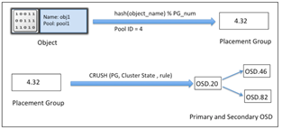
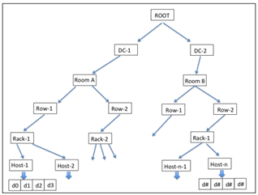
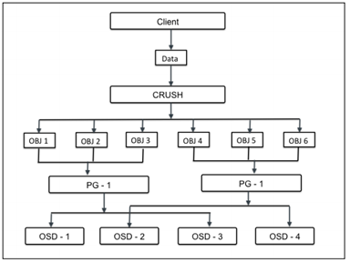

# Bên trong Ceph
---
## Object
Đối tượng gồm thành phần data và metadata được đóng gói => cung cấp 1 thuộc tính định danh (globally unique identifier). Định danh riêng bảo đảm object sẽ độc nhất trong storage cluster.

Khác file-based storage bị gói hạn size. Object có thể có size to và có thể thay đôi metadata. Data được lưu với nhiều metadata, các thông tin về nội dung data. Metadata trong object storage cho phép user quản lý và truy cập data không có cấu trúc.


> Object không giới hạn loại và số lượng metadata, cho phép thêm custom type trong metadata, vì thế ta có full quyền đối với data.

Ceph không lưu trữ dạng cây phân cấp, obj được lưu trên không gian địa chỉ với hàng ngàn obj , theo quy tắc tổ chức rõ ràng. Obj có thể đc lưu cục bộ, hoặc lưu tách biệt với mặt vật lý trong flat-address space trong không gian lưu trữ liền kề.

Kỹ thuật hỗ trợ obj có định danh độc nhất trên toàn cluster, bất kỳ app đều có thể lấy data từ object dựa vào OID (sử dụng RESTful API calls). Obj được lưu trong Object-based Storage Device (OSDs), theo pp nhân bản bản. Cung cấp tính HA. Khi Ceph storage cluster nhận yêu cầu ghi từ client, nó lưu data như obj. Tiền trình OSD ghi data tới file trong OSD file system.

### Định vị Object - Locating objects
- Mỗi đơn vị data trong Ceph được lưu dưới dạng obj trong pool.
- Ceph poop là logical partition sử dụng lưu trữ obj, cung cấp pp tổ chức storage.
- obj là đơn vị nhỏ nhất trong data storage tại Ceoh. Khi Ceph cluster được triển khai, nó tạo 1 số storage pool mặc định như data, metadata, and RBD pools.
- Sau khi MDS triển khai trên 1 Ceph node, nó tạo obj trong metadata pool đồng thời yêu cầu  CephFS để cung cấp tính năng.

## CRUSH
### Vấn đề
Kỹ thuật lưu trữ truyền thống sử dụng để lưu trữ data và meta data. Metadata là dữ liệu về các data được lưu, mổ ta về dữ liệu, nơi data được lưu thực thế (series of storage nodes and disk arrays). Mỗi thời điểm data được thêm mới vào storage system, metadata sẽ được cập nhật thông tiên về ví trí ghi, sau đó là nơi data được lưu thực sự.

Phương sử dụng tốt khi lưu trữ nhỏ (vài TB -> vài trăm TB) nhưng khi dữ liệu lên tới EB, pp xuất hiện các hạn chế (tính chịu lỗi đơn thấp (mất metadata => mất toàn bộ dữ liệu)) => pp giải quyết tạo những bản sao, lưu tại các vị trí khác nhau tăng tính chịu lỗi => pp phức tác, chứ nhiều vấn đề về storage system's scalability, high availability, and performance.

__Ceph__ đem đến cuộc cách mạng về data storage và khả năng quản lý. Nó sử dụng tt Crush, phân phối dữ liệu thông minh qua Ceph.
Thuật toán CRUSH là thành phần khiến Ceph trở nên nổi bật. Nó giúp Ceph tính toán quyết định vị trí lưu trữ. Thay vì lưu trữ metadata, CRUSH tính toán metadata khi yêu cầu, loại bỏ các điểm yếu khi sử dụng metadata theo cách truyền thống.

### CRUSH lookup
Kỹ thuật CRUSH làm việc cách, metadata computation workload (lượng tính toán metadata) được phân phối và thực hiện khi cần thiết. Tiến trình tính toán Metadata gọi là CRUSH Lookup, với công nghệ hiện nay cho phép hđ CRUSH Lookup diễn ra nhanh chóng vs hiệu năng cao.

Điểm đặc biệt cho CRUSH Lookup là không phụ thuộc vào hệ thống. Ceph cung cấp tính linh hoạt cho client thực hiện tính toán theo metadata khi cần bằng cách chạy CRUSH loop với tài nguyên của chính client, giảm công việc tại centrel.

Với các hoạt động tại Ceph cluster, client tương tác với Ceph monitor nhận lại cluster map. Cluster map giúp client biết trạng thái cấu hình Ceph cluster. Data được chuyển thành object với obj và pool name/IDs. Obj sau đối hashed với số vị trí group để sinh ra vị trí group cuối cùng mà không yêu cầu Ceph pool.

Tính toán ví trị group sẽ thông qua CRUSH lookup để quyết định vị trí primary OSD lưu và lấy lại. Sau tính toán, chiết xuất OSD ID, client liên hệ với OSD trực tiếp, lưu data. Tất các tính toán thực hiện bởi client, do đó nó không ảnh hưởng tới hiệu năng cluster. Khi data ghi tới primary OSD, node tương tự thực hiện hoạt động CRUSH lookup và tính toán vị trí secondary placement groups (vị trí phụ thứ yếu) và OSD, vì thế data được nhân rộng khắp Cluster cho tính HA.

```
VD:
Đầu tiên, Obj name và cluster placement group number được thêm với hash function và dựa trên pool IDs; vị trí group ID, PGID được tính ra. Tiếp theo Crush lookup thực hiện trên PGID để tìm primary và secondary OSD để ghi data.
```


## CRUSH hierarchy
### Giới thiệu
CRUSH có khả năng nhận thức hạ tâng, hoàn toàn do user cấu hình. Nó duy trì nested hierarchy (phân cấp lồng nhau) cho tất cả thành phân của hạ tâng. CRUSH device list thường là disk, node, rack, row, switch, power circuit, room, data center, and so on. Các thành phần được biết tới = failure zones or CRUSH buckets. CRUSH map chứa list các bucket có sẵn tập hợp các thiết bị trong các vị trí vật lý. Đồng thời chứa list rule cho phép CRUSH tính toán nhân bản data trên các Ceph pool khác nhau.



Dựa trên hạ tầng, CRUSH truyền data, nhân bản data trên khắp failure zones khiến data an toàn, có sẵn kể cả khi 1 số thành phần lỗi. Đây là cách CRUSH loại bỏ các thành phần có khả năng lỗi trên hạ tầng lưu trữ, đồng thời nó sử dụng các thiết bị thông thường mà vẫn đảm bảo tính HA (ko phải thiết bị chuyên dụng). CRUSH ghi data công bằng trên khắp cluster disk, tăng hiệu năng, tính bảo đảm, đưa tất cả disk vào cluster. Nó chắc rằng tất cả cluster disk được sử dụng bằng nhau kể cả khả năng lưu trữu khác nhau. Để làm được điều đó, CRUSH cấp phát weights trên mỗi OSD. Cân năng càng cao trên OSD thì khả năng lưu trữ của chính OSD càng cao, từ đó CRUSH ghi nhiều data tới những OSD này, duy trì tính cân bằng trên các thiết bị.

### Khôi phục, tái cân bằng - Recovery and rebalancing
Trong trường hợp bắt kỳ thành phần xảy ra lỗi trong failure zone, Ceph chờ 300s theo mặc định trước khi nó đánh dấu OSD down và thực hiện quá trình khôi phục. Tùy chỉnh được thực hiện bằng trường "mon osd down out interval" tại file cấu hình của Ceph cluster. Trong quá trình khôi phục, Ceph khôi phục lại các dữ liệu bi ảnh hưởng trên node lỗi.

Vì CRUSH nhân bản dữ liệu trên nhiều disk, các phiên bản data sẽ được sử dụng cho khôi phục. CRUSH cố gắng di chuyển các dữ liệu ít nhất trong quá trình khôi phục, thiết kế lại cluster layout, khiến cho dù Ceph chịu lỗi vẫn có thể sử dụng bình thường

Khi host mới hoặc disk được thêm vào Ceph cluster, CRUSH bắt đầu quá trình tái cần bằng - di chuyển data từ host/disk có sẵn tới new host/disk. Quá trình tái cần bằng giữ tất cả disk cân bằng, nâng cao hiệu năng cluster, giữ khả năng đáp ứng cao.

```
VD: Nếu Ceph cluster chứa 2000 OSDs, 1 hệ thông mới được thêm vào với 20 OSDs mới => 1 chỉ % data sẽ được chuyển trong quá trình tái cân bằng, tất cả OSDs đã có sẽ làm việc song song khi chuyển data, giữ các hoạt động diễn ra binh thường. Tuy nhiên Ceph cluster được sử dụng nhiều trong thời điểm này, nó khuyên cáo thêm OSD mới với weight 0 và dần dần tăng weight tới giá trị cáo hơn dữ trên size. Theo cách đó, 1 OSD mới sẽ yêu cầu hoạt động tái cân bằng diễn ra thấp hơn, tránh làm giảm hiệu năng.
```

## Vị trí nhóm - Placement groups
Khi Ceph cluster nhận yêu cầu từ data storage, nó sẽ chia thành nhiều phẩn đc gọi là placement groups (PG). Tuy nhiên, CRUSH data đầu tiên được chia nhỏ thành tập các Obj, dựa trên hoạt động hash trên tên obj , mức nhân bản, tổng các placement groups trong hệ thông, placement groups IDs được sinh ra tương ứng.

__Placement groups__ là tập logical (logical collection) các obj được nhân bản trên các OSDs để nâng cao tính bảo đảm trong storage system. Dựa trên mức nhân bản của Ceph pool, mỗi placement group sẽ được nhân bản, phân tán trên nhiều hơn 1 OSD tại Ceph cluster. Ta có thể cân nhắc placement group như logical container giữ nhiều obj = logical container is mapped to multiple OSDs. __Placement groups (vị trí nhóm)__ được thiết kế đáp ứng khả năng mở rộng, hiệu suất cao trong Ceph storage system.



Nếu không có placement groups, nó sẽ khó cho việc quản trị, theo dõi các obj được nhân bản (hảng triệu obj được nhân bản) tới hàng trăm các OSD khác nhau. Thay vì quản lý tất cả obj riêng biệt, hệ thông cần quản lý placement group với numerous objects (số lượng nhiều các obj). Nó khiến ceph dễ quản lý và giảm bớt sự phức tạp. Mỗi placement group yêu cầu tài nguyên hệ thống, CPU và Memo vì chúng cần quản lý nhiều obj.

Số lượng placement group trong cluster cần được tính toán tỉ mỉ. Thông thường, tăng số lượng placement groups trong cluster sẽ giảm bớt gánh nặng trên mỗi OSD, nhưng cần xem xét theo quy chuẩn. 50-100 placement groups trên mỗi OSD được khuyến cáo. Nó tránh tiêu tốn quá nhiều tài nguyên trên mỗi OSD node. Khi data tăng lên, ta cần mở rộng cluster cùng với nhiều chỉnh số lượng placement groups. Khi thiệt bị được thêm, xóa khởi cluster, các placement group sẽ vẫn tồn tại – CRUSH sẽ quản lý việc tài cấp pháp placement groups trên toàn cluster.

> PGP is the total number of placement groups for placement purposes. This should be equal to the total number of placement groups.

### Tính toán số PG cần thiết - Calculating PG numbers
Quyết đinh PG là bước cần thiết khi xây dựng nên tảng Ceph storage cluster cho doanh nghiệp. Placement group có thể tăng hoặc làm ảnh hưởng tới hiệu năng storge.
Công thức tính tổng placement group cho Ceph cluster:
```
Total PGs = (Total_number_of_OSD * 100) / max_replication_count

Kết quả có thể làm tròn gần nhất theo 2 ^ đơn vị.
```
__Ví dụ thực tế__
```
Tổng OSDs = 160, mức nhận bản = 3, tổng pool = 3 => Tông PGs = 1777.7 => kết quả tính theo 2^.. = 2048 PGs trên mỗi pool.
```

> Việc cân bẳng tông PGs/pool với số PGs/OSD rất quan trọng, nó ảnh hưởng tới hđ OSD, giảm tiển trình khôi phục.

## Ceph pools
### Giới thiệu
Ceph pool cung cấp khả năng quản lý storage = pool. Ceph pool = logical partition để lưu các obj. Mỗi pool trong Ceph lưu 1 số các placement group – giữ số lượng acsc obj mapp tới OSDs trên khắp cluster. Vì thế mỗi single pool được phân phối khắp cluster nodes.

## Ceph data management
### Giới thiệu
Quản lý data bên trong cluster bao gồm tất cả thành phần bên trong Ceph. Sự kết hợp các thành phần mang đến cho Ceph tính bảo đảm, tin cậy, mạnh mẽ.

Data management bắt đầu kể từ khi client ghi data xuống Ceph pool. Dữ liệu đầu tiên sẽ ghi tới primary OSD sau đó tới các OSD thứ cấp theo cấu hình mức nhân bản tùy chỉnh.
