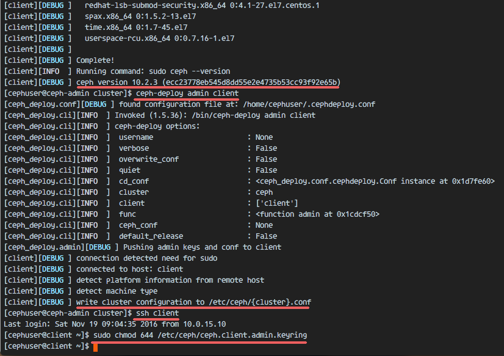
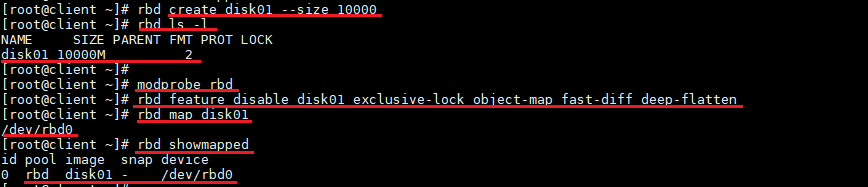
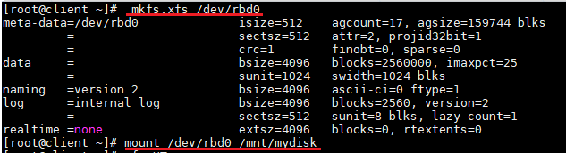
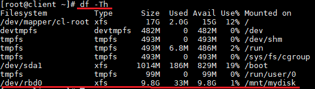

# Sử dụng Ceph như Block Device trên CentOS 7
---
## Chuẩn bị
Sử dụng lab: [Cài đặt Ceph Storage Cluster trên CentOS 7](ceph-install-lab.md)

## Bắt đầu
### Phần 1: Cấu hình Ceph Client Node
> Ta sẽ cấu hình CentOS 7 như Ceph client

#### Bước 1: Cấu hình Client Node
Truy cập Ceph client node
```
ssh root@client
```
Tạo Ceph user 'cephuser' trên tất các các nodes.
```
useradd -d /home/cephuser -m cephuser
passwd cephuser
```
Cấp quyền root cho user vừa tạo
```
echo "cephuser ALL = (root) NOPASSWD:ALL" | sudo tee /etc/sudoers.d/cephuser
chmod 0440 /etc/sudoers.d/cephuser
sed -i s'/Defaults requiretty/#Defaults requiretty'/g /etc/sudoers
```
#### Bước 2: Cấu hình NTP
Sử dụng NTP đồng bộ thời gian trên tất cả các Node.
> Ở đây sử dụng NTP pool US.

```
yum install -y ntp ntpdate ntp-doc
ntpdate 0.us.pool.ntp.org
hwclock --systohc
systemctl enable ntpd.service
systemctl start ntpd.service
```

#### Bước 3: Cấu hình file host
```
vim /etc/hosts

# content
192.168.2.128 ceph-admin
192.168.2.129 mon1
192.168.2.130 osd1
192.168.2.131 osd2
192.168.2.132 client
```

### Phần 2: Cấu hình tại Ceph Admin Node
Sử dụng ceph-admin node để thiết lập Ceph client node
#### Bước 1: Truy cập Ceph admin node
```
ssh root@ceph-admin
```

#### Bước 2: Kiểm tra cấu hình ssh config, host file
Kiểm tra cấu hình file ssh config
```
vim ~/.ssh/config

# Thêm nếu chưa có
Host client
        Hostname client
        User cephuser


vim /etc/hosts

# Thêm nếu chưa có
192.168.2.132 client
```

Kiểm tra, thiết lập ssh với client
```
ssh-keyscan client >> ~/.ssh/known_hosts
ssh-copy-id client
```

Kiểm tra kết nối tới client
```
ssh client
```
> Nhập passwd khi lần đàu truy cập

### Phần 3: Cài đặt Ceph tại Client Node
> Cài đặt Ceph tới Client Node bằng ceph-admin node

#### Bước 1: Truy cập ceph-admin
```
ssh root@ceph-admin
```
#### Bước 2: Truy cập Cluster directory
```
cd cluster/
```

#### Bước 3: Cài đặt Ceph trên client = ceph-admin
```
ceph-deploy install client
ceph-deploy admin client
```

#### Bước 4: Cấu hình quyển truy cập admin key (Tại client node)
```
ssh client
sudo chmod 644 /etc/ceph/ceph.client.admin.keyring
```



### Phần 4: Cấu hình, Mount Ceph như Block Device
> Ceph cho phép sử dụng Ceph Cluster cung cấp block device. Ta có thể sử dụng Ceph storage như hard drive thông thường. Ceph Block Storage hoặc Ceph RADOS Block Storage (RBD) lưu block device image như Object. Tự động nhận bản obj đó tới toàn Ceph Cluster.

#### Thiết lập tại Ceph Client
Truy cập Client Node
```
ssh client
```
Sử dụng RBD cmd quản lý rados block device image. Cmd cho phép tạo mới image, resize, tạo snapshot, ..
```
rbd create disk01 --size 10000
rbd ls -l
```

Kích hoạt RBD kernel module
```
sudo modprobe rbd
sudo rbd feature disable disk01 exclusive-lock object-map fast-diff deep-flatten
```
Map disk01 image tới block device thông qua rbd kernel module
```
sudo rbd map disk01
rbd showmapped
```


> disk01 image được map tới /dev/rbd0, từ đây ta có thể sử dụng nó như ổ đĩa thông thường

Định dạng XFS cho ổ đĩa
```
sudo mkfs.xfs /dev/rbd0
```

Mount '/dev/rbd0' tới mnt directory.
```
sudo mkdir -p /mnt/mydisk
sudo mount /dev/rbd0 /mnt/mydisk
```



> Ceph RBD or RADOS Block Device đã được cấu hình và mount vào hệ thông. Kiểm tra thông quá command

Kiểm tra lại kết quả
```
df -hT
```


### Phần 5: Thiết lập RBD tại thời điểm khởi động
#### Bước 1: Tạo file tại đường dẫn /usr/local/bin thực hiện hoạt động mount hoặc umount
```
cd /usr/local/bin/
vim rbd-mount

# content
#!/bin/bash

# Script Author: http://bryanapperson.com/
# Change with your pools name
export poolname=rbd

# CHange with your disk image name
export rbdimage=disk01

# Mount Directory
export mountpoint=/mnt/mydisk

# Image mount/unmount and pool are passed from the systems service as arguments
# Determine if we are mounting or unmounting
if [ "$1" == "m" ]; then
   modprobe rbd
   rbd feature disable $rbdimage exclusive-lock object-map fast-diff deep-flatten
   rbd map $rbdimage --id admin --keyring /etc/ceph/ceph.client.admin.keyring
   mkdir -p $mountpoint
   mount /dev/rbd/$poolname/$rbdimage $mountpoint
fi
if [ "$1" == "u" ]; then
   umount $mountpoint
   rbd unmap /dev/rbd/$poolname/$rbdimage
fi
```
Thêm quyền kịch hoạt
```
chmod +x rbd-mount
```

Bước 2: Tạo service cho CentOS 7, tự động khởi tạo khi khởi động
Tới systemd directory, tại service file
```
cd /etc/systemd/system/
vim rbd-mount.service

# content
[Unit]
Description=RADOS block device mapping for $rbdimage in pool $poolname"
Conflicts=shutdown.target
Wants=network-online.target
After=NetworkManager-wait-online.service
[Service]
Type=oneshot
RemainAfterExit=yes
ExecStart=/usr/local/bin/rbd-mount m
ExecStop=/usr/local/bin/rbd-mount u
[Install]
WantedBy=multi-user.target
```

Thiết lập service vừa tạo
```
systemctl daemon-reload
systemctl enable rbd-mount.service
```

## Nguồn
https://www.howtoforge.com/tutorial/using-ceph-as-block-device-on-centos-7/
