# Cấu hình LVM cơ bản (Thêm sửa xóa)
---
## Chuẩn bị
Thiết lập máy ảo như sau:


## Phần 1: Tạo Logical Volume trên LVM
### Bước 1: Kiểm tra các ổ cứng hiện tại
```
# lsblk
```
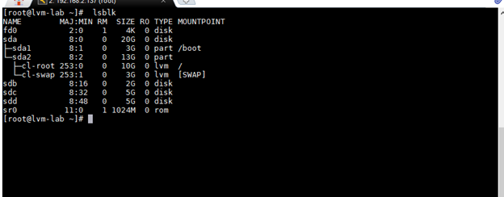

### Bước 2: Tạo Partition
```
# fdisk /dev/sdb
```

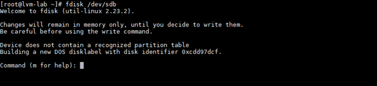

Tháo tác:
- Chọn n để bắt đầu tạo partition
-	Chọn p để tạo partition primary
-	Chọn 1 để tạo partition primary 1
-	Tại First sector (2048-20971519, default 2048) để mặc định
-	Tại Last sector, +sectors or +size{K,M,G} (2048-20971519, default 20971519) chọn +1G để partition bạn tạo ra có dung lượng 1 G
-	Chọn w để lưu lại và thoát.

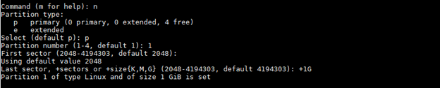

Tháo tác:
- Chọn t để thay đổi định dạng partition
- Chọn 8e để đổi thành LVM

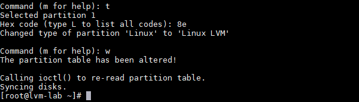

Lặp các bước với sdc

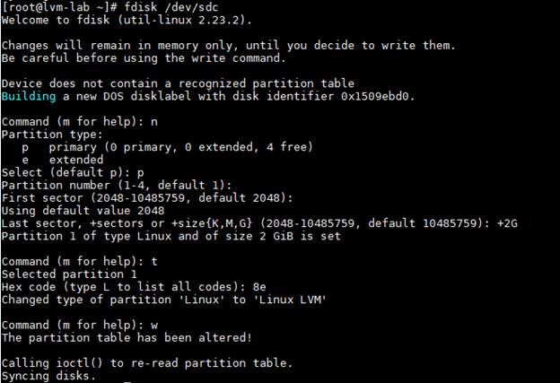

### Bước 3: Tạo Physical Volume

Tạo các Physical Volume là /dev/sdb1 và /dev/sdc1 bằng các lệnh:
```
# pvcreate /dev/sdb1
# pvcreate /dev/sdc1
```
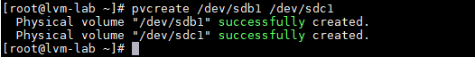

### Bước 4: Tạo Volume Group
Nhóm các Physical Volume thành 1 Volume Group bằng:
```
# vgcreate vg-demo1 /dev/sdb1 /dev/sdc1
```
> vg-demo1 là tên của Volume Group

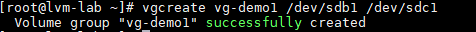

Kiểm tra lại các Volume Group đã tạo:
```
# vgs
# vgdisplay
```
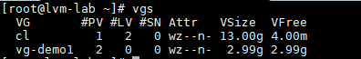

### Bước 5: Tạo Logical Volume
Từ một Volume Group,  tạo ra các Logical Volume bằng:
```
# lvcreate -L 1G -n lv-demo1 vg-demo1
```
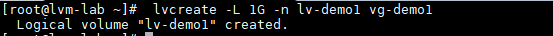
> -L: Chỉ ra dung lượng của logical volume
> -n: Chỉ ra tên của logical volume
> Note: lv-demo1 là tên Logical Volume, vg-demo1 là Volume Group mà vừa tạo

Kiểm tra:
```
# lvs
# lvdisplay
```

### Bước 6: Định dạng Logical Volume
```
# mkfs -t ext4 /dev/vg-demo1/lv-demo1
```
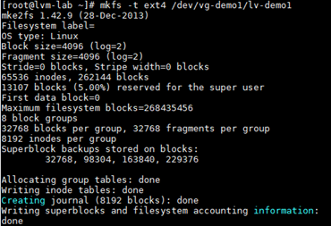

### Bước 7: Mount và sử dụng
Tạo thư mục mount
```
# mkdir demo1
```

Tiến hành mount logical volume lv-demo1 vào thư mục demo1
```
# mount /dev/vg-demo1/lv-demo1 demo1
```
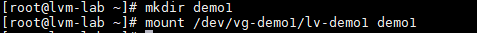

Kiểm tra lại dung lượng
```
df -h
```
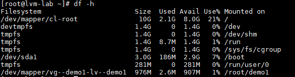

## Phần 2: Thay đổi dung lượng Logical Volume trên LVM
### 2.1 - Kiểm tra toàn bộ
```
# vgs
# lvs
# pvs
```
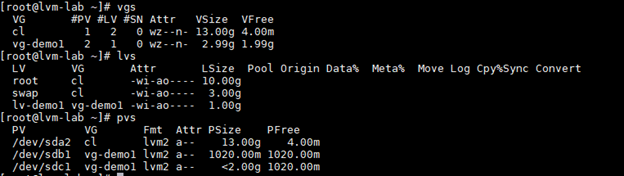

### 2.2 - Kiểm tra dung lượng Volume Group
Trước khi tăng, cần kiểm tra xem Volume Group còn dư dung lượng để kéo dãn
```
# vgdisplay
```
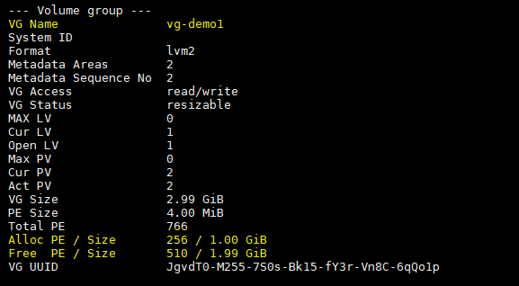

### 2.3 - Tăng kích thước Logical Volume
Để tăng kích thước Logical Volume, sử dụng câu lệnh sau:
```
# lvextend -L +50M /dev/vg-demo1/lv-demo1
```
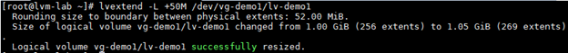

Kiểm tra lại
```
lvs
```
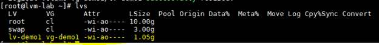

> Kích thước cho Logical Volume thì Logical Volume đã được tăng nhưng file system trên volume này vẫn chưa thay đổi, sử dụng lệnh sau:
```
# resize2fs /dev/vg-demo1/lv-demo1
```
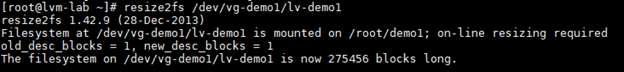

### 2.4 - Giảm kích thước Logical Volume
Tiến hành giảm kích thước của Logical Volume
```
# lvreduce -L 20M /dev/vg-demo1/lv-demo1
```
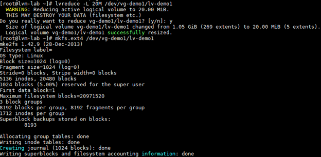

Tiến hành format lại Logical Volume
```
# mkfs.ext4 /dev/vg-demo1/lv-demo1
```
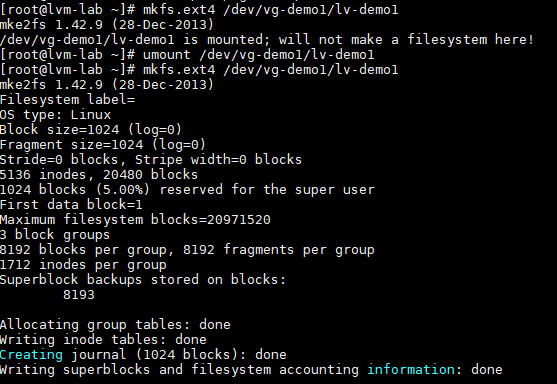

Mount lại Logical Volume
```
# mount /dev/vg-demo1/lv-demo1 demo1
```

## Phần 3: Thay đổi dung lượng Volume Group trên LVM
Việc thay đổi kích thước của Volume Group chính là việc nhóm thêm Physical Volume hay thu hồi Physical Volume ra khỏi Volume Group
### 3.1 - Kiểm tra lại các partition và Volume Group
```
# vgs
# lsblk
```
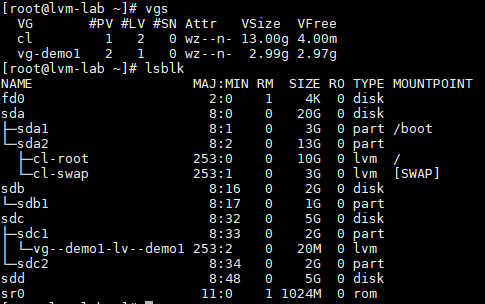

### 3.2 - Nhóm thêm partition vào Volume Group
Nhóm thêm 1 partition vào Volume Group như sau:
```
# vgextend /dev/vg-demo1 /dev/sdc2
```
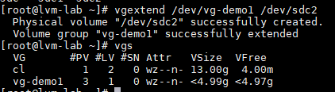

### 3.3 - Cắt Physical Volume ra khỏi Volume Group
Cắt 1 Physical Volume ra khỏi Volume Group như sau:
```
# vgreduce /dev/vg-demo1 /dev/sdc2
```
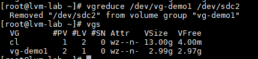

## Phần 4: Xóa Logical Volume, Volume Group, Physical Volume
Trước tiên ta phải Umount Logical Volume
```
# umount /dev/vg-demo1/lv-demo1
```
### 4.1 - Xóa Logical Volume
Xóa Logical Volume bằng câu lệnh sau:
```
# lvremove /dev/vg-demo1/lv-demo1
```
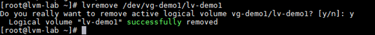
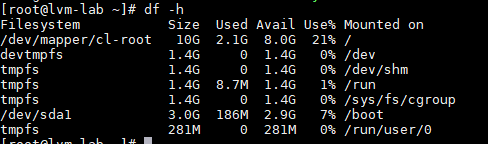

### 4.2 - Xóa Volume Group
Trước khi xóa Volume Group, chúng ta phải xóa hết Logical Volume
```
# vgremove /dev/vg-demo1
```
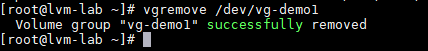

### 4.3 - Xóa Physical Volume
```
# pvremove /dev/sdc2
```
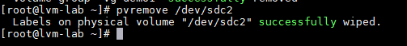
