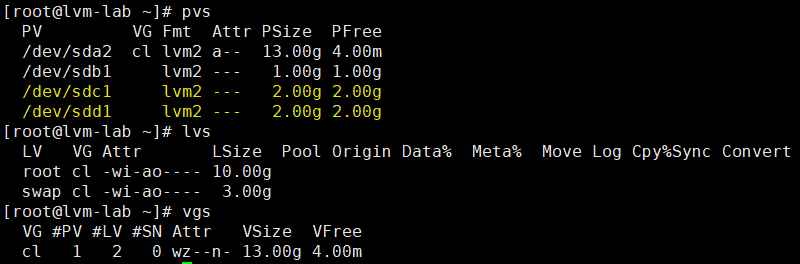
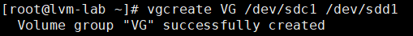
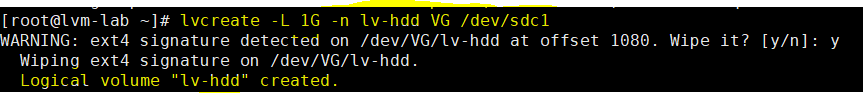
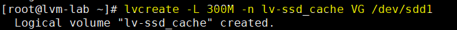
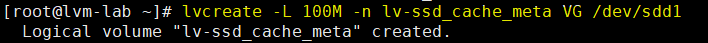
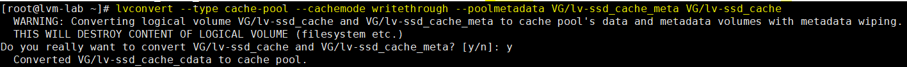
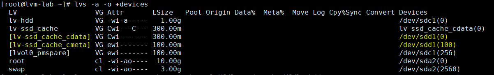
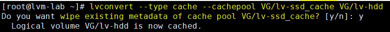
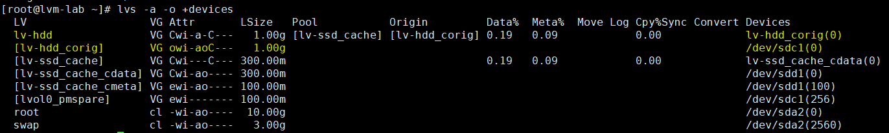

# Cache Volume
---
## Giới thiệu
Loại cache logical volume sử dụng LV nhỏ nằm trong phân vùng có tốc độ truy vấn nhanh (SSD), nâng cao hiệu năng LV nằm trên phân vùng lớn, chậm hơn (Hdd).

Thực hiện phương pháp bằng cách lưu các block thường xuyên được sử dụng trên LV có tốc độ truy cập nhanh.

Do yêu cầu từ dm-cache (kernel driver), LVM chia cache pool LV thành 2 phần:
- Cache data LV
- Cache metadata LV

__Ý tưởng__
- Tạo 1 Cache LV, 1 Cache meta LV trên SSD.
- Sử dụng 2 phân vùng trên tạo cache pool logical volume, thêm Cache pool vào LV có tốc độ truy vấn chậm

__Thuật ngữ__
- __Cache data logical volume__ - logical volume chứa data blocks của cache pool logical volume
- __Cache metadata logical volume__ -  logical volume chứa metadata của cache pool logical volume, giữ thông tin nơi mà các khối dữ liệu được lưu trữ (for example, on the origin logical volume or the cache data logical volume).
- __Cache logical volume__ - logical volume chứa origin logical volume và cache pool logical volume. Đây là thiết bị sử dụng đóng gói các cache volume component khác nhau.

## Cấu hình
### Kiểm tra cấu hình hiện tại
```
# lvs
# vgs
# pvs
```
> __sdc1 = ổ hdd thông thường__

> __sdd1 = ổ ssd__



### Tạo volume group chuẩn
__Volume group bao gồm cả phân vùng ssd và hdd__
```
# vgcreate VG /dev/sdc1 /dev/sdd1
```


### Tạo LV trên phân vùng HDD
```
# lvcreate -L 1G -n lv-hdd VG /dev/sdc1
```


### Tạo cache data logical volume trên phân vùng SSD
```
# lvcreate -L 300M -n lv-ssd_cache VG /dev/sdd1
```
> Thường cache data logical volume rất lớn (cache data)



### Tạo cache metadata logical volume trên phân vùng SSD
```
# lvcreate -L 100M -n lv-ssd_cache_meta VG /dev/sdd1
```
> Sử dụng cache metadata lên không cần lớn



### Tạo cache pool logical volume
```
# lvconvert --type cache-pool --cachemode writethrough --poolmetadata VG/lv-ssd_cache_meta VG/lv-ssd_cache
```
> Kết hợp cache data và cache metadata logical volumes trong logical volume loại cache-pool

> Sau khi thực hiện cmd, cache data logical volume __thêm hậu tố _cdata__, cache metadata logical volume __thêm hậu tố _cmeta__.

> Cả 2 volume sẽ ẩn đi.



#### Kiểm tra thông số cache pool LV
```
# lvs -a -o +devices
```


### Kết hợp cache pool logical volume với origin logical volume
```
# lvconvert --type cache --cachepool VG/lv-ssd_cache VG/lv-hdd
```
> Origin logical volume sẽ ẩn đi.

> Origin logical volume gốc sẽ được thêm hậu tố _corig.



#### Kiểm tra thông số sau cấu hình kết hợp
```
lvs -a -o +devices
```


## Nguồn
http://fibrevillage.com/storage/460-how-to-create-lvm-cache-logical-volume
