# Mirrored Logical Volume
---
## Giới thiệu
Mirrored Logical Volume duy trì bản sao dữ liệu giống nhau trên thiết bị khác nhau. Khi data được ghi tới 1 device, nó cũng sẽ được ghi tới 1 thiết bị khác (mirroring the data).
Phương pháp cung cấp tính bảo vệ dữ liệu khi thiết bị lỗi.

LVM hỗ trợ mirrored volumes. Khi ta tạo mirrored logical volume, LVM sẽ chắc chắn ghi data tới vị trí mirrored tại thiết bị khác.
Với LVM, ta có thể tạo mirrored logical volume với nhiều mirrors.

LVM mirror duy trì lượng log nhỏ, sử dụng để theo dõi phân vùng được đồng bộ với mirror (1 hoặc nhiều).

### Tính năng
- Chuyển logical volumes từ 1 disk tới 1 disk khác.
- Ta có thể sử dụng bất kỳ loại disk nào như SATA, SSD, SAS, SAN storage iSCSI hoặc FC.
- Migrate disk tránh lỗi, khi xảy ra lỗi sẽ không có downtime.

### Mô hình
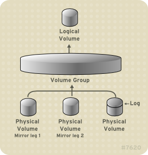

## Cấu hình
### Bước 1: Tạo ổ đĩa, định dạng, dữ liệu test tính năng mirrors
__Kiểm tra thông số ban đầu__
```
# pvs
# vgs
# lvs
```
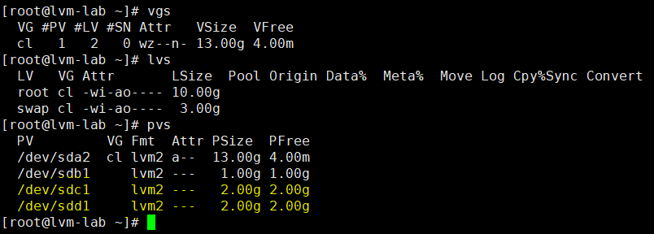

> Ta sẽ sử dụng 2 ổ __sdc1 và sdd1__ để xây dựng lab.

> __sdc1__ - ổ chính

> __sdd1__ - ổ mirror

__Tạo ổ đĩa__
```
# vgcreate vg-group /dev/sdc1
```
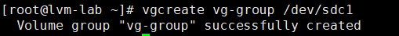

__Tạo LV, định dạng__
```
# lvcreate -L 900M -n lv_target vg-group
# mkfs.ext4 /dev/vg-group/lv_target
```
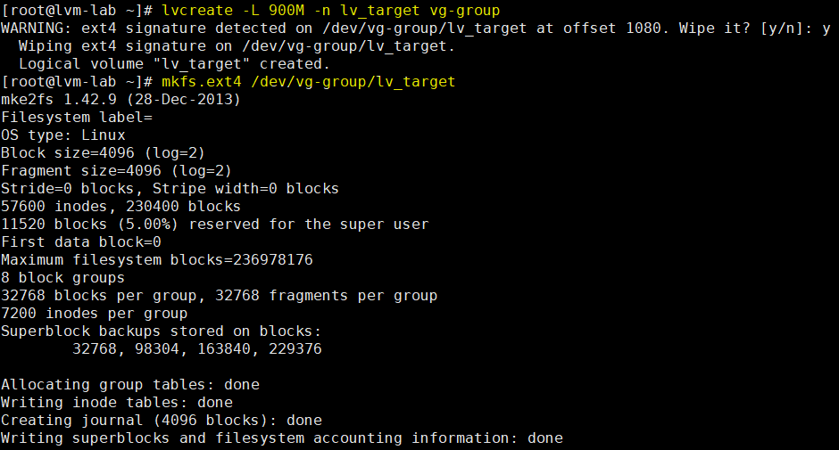

__Mount và tạo dữ liệu test__
```
# mount /dev/vg-group/lv_target /data-store/data/
# ls /data-store/data/
```
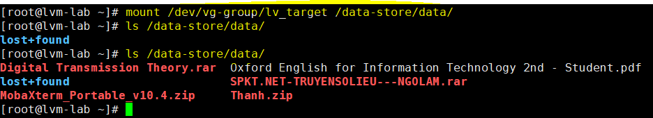

__Kiểm tra lại thông tin lv, vg vừa tạo__
```
# lvs
# vgs -o+devices
```
> Ở đây __/dev/sdc1__ đang giữ dữ liệu

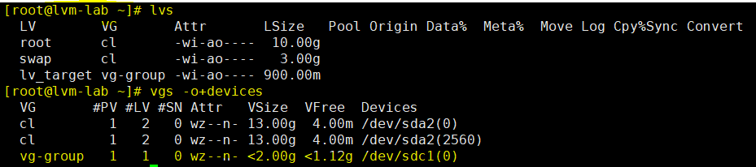

### Bước 2: Thêm, tạo ổ đĩa mới (Dùng cho hoạt động mirror)
__Sử dụng ổ /dev/sdd1 làm ổ Mirror__
```
# pvs
```
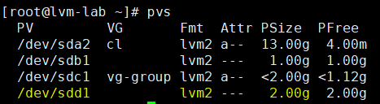

__Mở rộng VG bằng ổ mới (Mirror disk)__
```
# vgextend vg-group /dev/sdd1
# vgdisplay vg-group -v
```
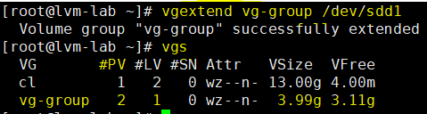

__Kiểm tra ổ đang map tới LV__
```
# lvs -o+devices
# dmsetup deps /dev/vg-group/lv_target
```
> Ở đây (8,33) là ảnh xạ LV tới /dev/sdc1

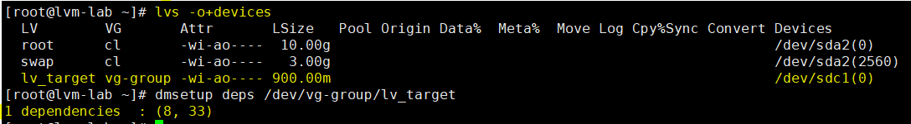

### Bước 3: Cấu hình LVM Mirroring
__Cấu hình migrate data từ LV cũ tới LV Mirror__
```
# lvconvert -m 1 /dev/vg-group/lv_target /dev/sdd1
```
> -m = mirror

> 1 = Thêm single mirror

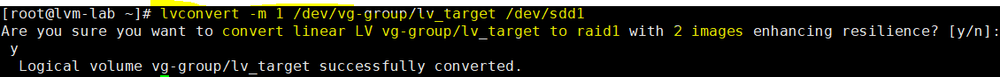

__Kiểm tra cấu hình sau khi add Mirror__
```
# lvs -o+devices
```
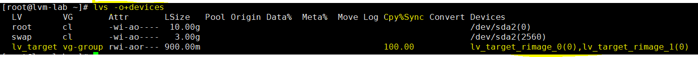

__Xóa ổ đĩa cũ (LV old)__
```
# lvconvert -m 0 /dev/tecmint_vg/tecmint_lv /dev/vdb1
```
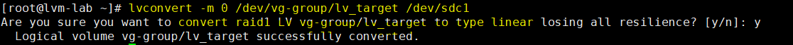

__Kiểm tra thông số hiện tại__
```
# lvs -o+devices
# dmsetup deps /dev/vg-group/lv_target
```
> Tại thời điểm LV ánh xạ sang ổ Mirror (sdd1)

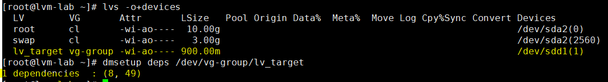

__Xóa LV cũ ra khỏi VG__
```
# vgreduce /dev/vg-group /dev/sdc1
```
> Dữ liệu đã được bảo đảm dù không có ổ sdc1

> Sau khi xóa ổ sdc1 khỏi VG, dữ liệu vẫn còn vì đã migrated từ sdc1 -> sdd1

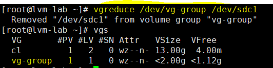

__Kiểm tra lại data ban đầu__
```
# ls /data-store/data/
```
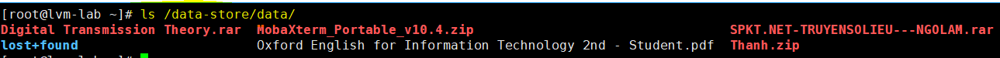
