# LVM Snapshot
---
## Giới thiệu
LVM snapshot cung cấp tính năng cho phép tạo virtual images của thiết bị được chọn lập tức mà không làm gián đoạn các dịch vụ đang chạy.

Khi thay đổi được thực hiện sau khi thiết bị đã được snapshot, tính năng snapshot sẽ tạo bản copy khu vực, cho phép khôi phục khi cần.

Vì Snapshot chỉ sao chép phân vùng dữ liệu thay đổi sau khi snapshot được tạo => yêu cầu khối lượng lưu trữ nhỏ. VD: đối với dữ liệu ít được thay đổi, bản snap chỉ nặng từ 3-5% khi so sánh với phiên bản gốc.

## Chuẩn bị
### Thiết lập máy ảo như sau:
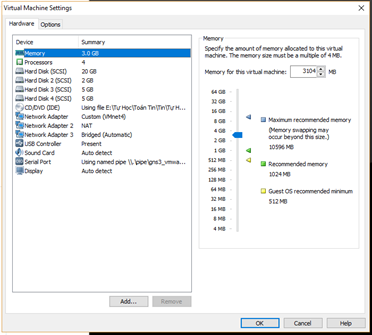

## Bắt đầu
### Phần 1: Tạo LVM Snapshot
#### Kiểm tra thông số trước khi cấu hình
```
# vgs
# lvs
# pvs
```
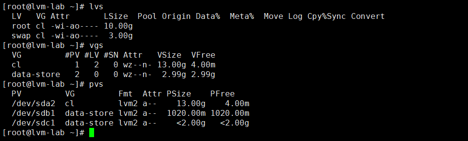

#### Tạo LV
```
# lvcreate -L 1G -n store-1 data-store
```
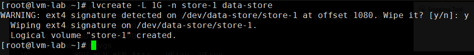
### Tạo Snapshot cho LV vừa tạo
```
# lvcreate -L 1GB -s -n store-1_snap /dev/data-store/store-1
```
> -s – Tạo Snapshot

> -n – Tên cho snapshot

> Cú pháp: lvcreate -L [Size] -s -n [Tên] [Snapshot cho LV]

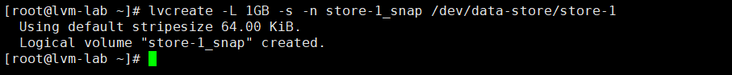

### Xoá Snapshot vừa Tạo
```
# lvremove /dev/data-store/store-1_snap
```
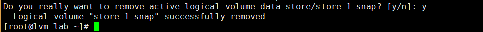

### Kiểm tra snapshot vừa tạo
```
# lvs
```
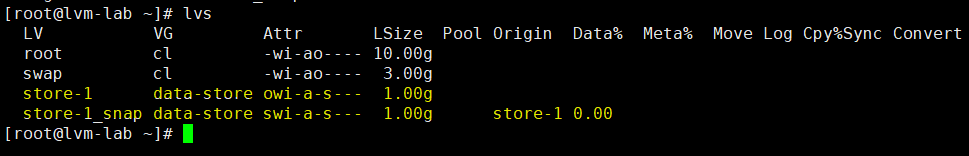
### Kiểm chứng (Thêm dữ liệu và kiểm tra thông số thay đổi)
__Thêm định dạng, mount vào OS, kiểm tra__
```
# mkfs -t ext4 /dev/data-store/store-1
```
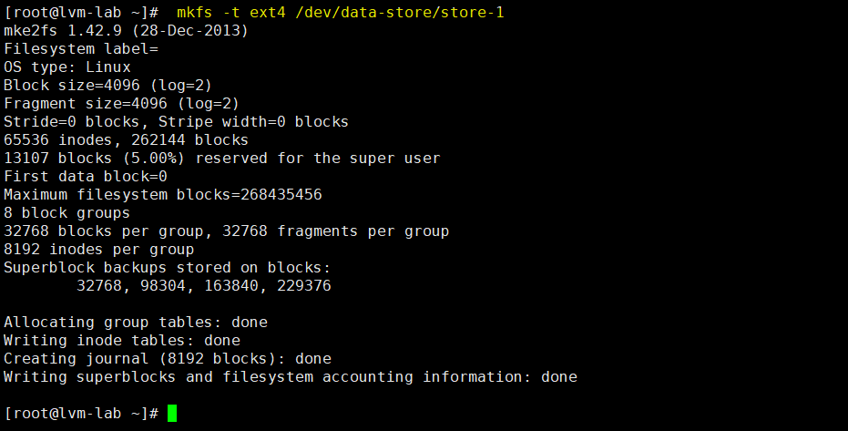
```
# mount /dev/data-store/store-1 /data-store/store-1
```
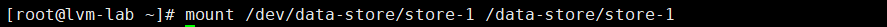
```
# df -Th
```
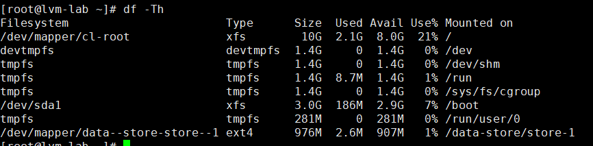

__Thêm dữ liệu, kiểm tra thay đổi__
```
# lvs
# df -Th
```
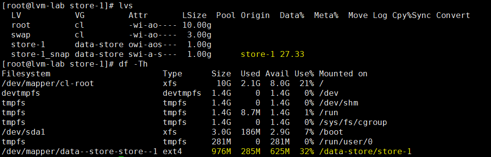

> Khi dữ liệu trong thư mục thay đổi, snapshot size sẽ thay đổi theo

__Vấn đề__

> Nếu LVM đầy, snapshot sẽ tự động xóa. Tính năng bảo đảm sẽ luôn có đủ không gian lưu FS.

### Phần 2: Mở rộng LVM
#### Mở rộng Snapshot
```
# lvextend -L +100M /dev/data-store/store-1_snap
```
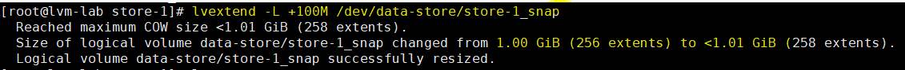
#### Kiểm tra lại thông số
```
# lvs
# lvdisplay
```
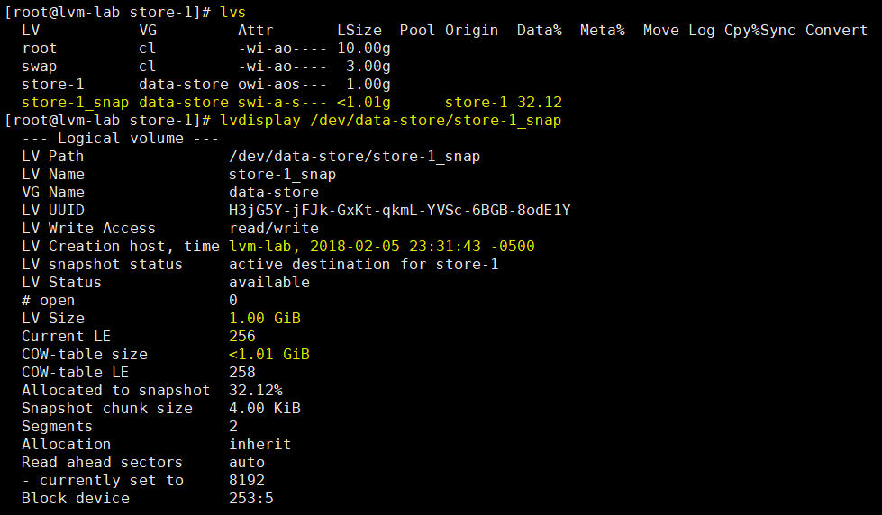

### Phần 3: Khôi phục Snapshot (Merging)
#### Umount thư mục
```
# umount /data-store/store-1
```
__Kiểm tra__
```
# df -h
```
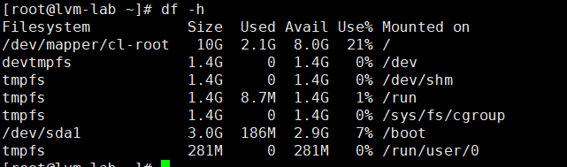
#### Khôi phục theo Snapshot
```
# lvconvert --merge /dev/data-store/store-1_snap
```
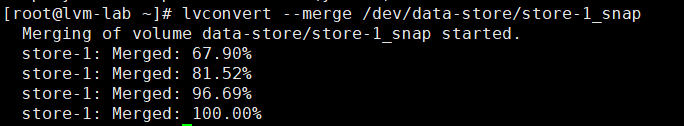
> Sau câu lệnh trên dữ liệu quay về thời điểm SNAPSHOT

```
# lvs
```
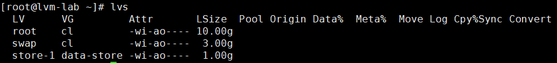
> __Mặc định snapshot volume sẽ tự động removed__

__Kiểm tra__
```
# df -Th
```
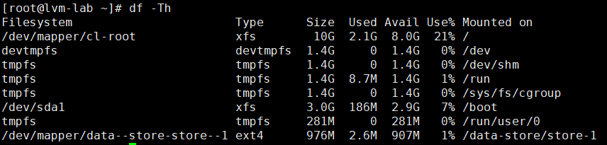

### Tự động mở rổng Snapshot (Xem thêm tài liệu gốc)

## Nguồn
https://www.tecmint.com/take-snapshot-of-logical-volume-and-restore-in-lvm/
https://rwmj.wordpress.com/2014/05/22/using-lvms-new-cache-feature/
