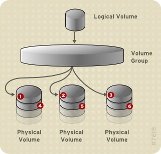
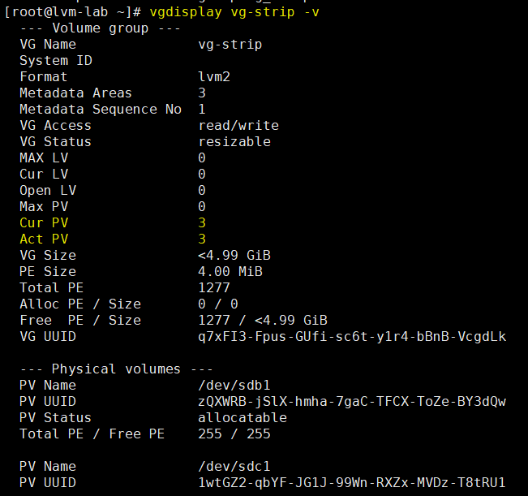
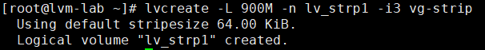
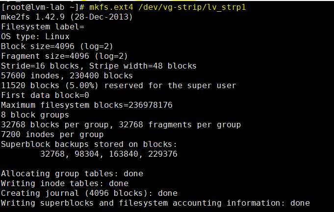
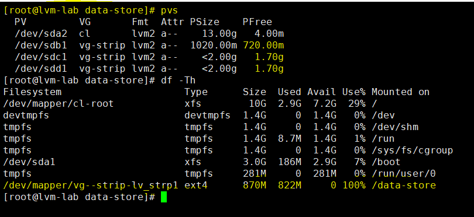

# Striped Logical Volumes
---
## Giới thiệu
Khi dữ liệu được ghi xuong LVM logical volume, File system sẽ đặt data nằm suốt các physical volume.

Có thể kiếm soát cách data được ghi xuống physical volumes băng cách tạo striped logical volume.

Với khối lượng đọc ghi lớn, khi sử dụng phương pháp này hiệu năng data IO sẽ được nâng cao.
Striped Logical nâng cao hiệu năng = ghi data đến 1 số các physical volumes chỉ đinh trước - với striping, IO thực hiện song song.

### Mô hình


### Cách ghi dữ liệu


## Cấu hình
### Tạo volume group
__Kiểm tra cấu hình hiện tại__
```
# pvs
# vgs
# lvs
```


#### Tạo VG
```
# vgcreate vg-strip /dev/sdb1 /dev/sdc1 /dev/sdd1
```
#### Kiểm tra thông tin VG vừa tạo
```
# vgdisplay vg-strip -v
```


### Tạo LV striped
```
# lvcreate -L 900M -n lv_strp1 -i3 vg-strip
```
> -L – logical volume size

> -n – logical volume name

> -i – stripes <= số Disk


#### Kiểm tra LV strip vừa tạo
```
# lvdisplay vg-strip/lv_strp1 -m
```


### Kiểm chứng
#### Định dạng FS cho LV vừa tạo
```
# mkfs.ext4 /dev/vg-strip/lv_strp1
```

#### Mount vào OS
```
# mount /dev/vg-strip/lv_strp1 /data-store/
```
> __Đưa dữ liệu test và xem cơ chế phân tán dữ liệu__

#### Kiểm tra đối chiếu
```
# pvs
```


> Phân vùng 900 MB được chia đều đến các PV __sdb1 sdc1 sdd1__
