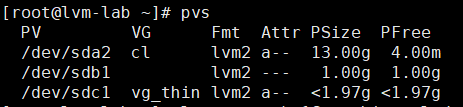
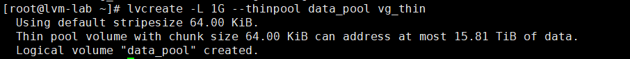
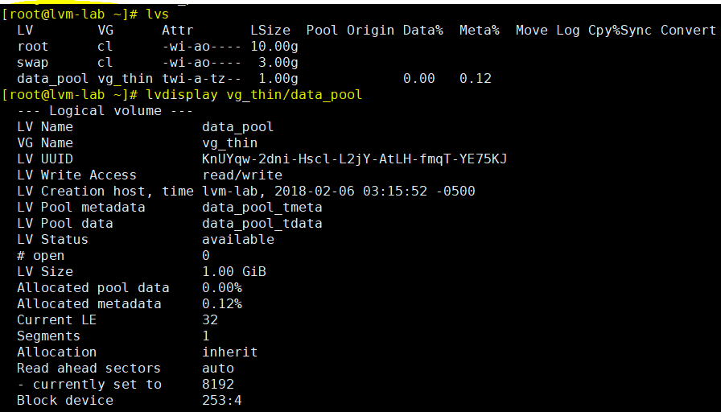
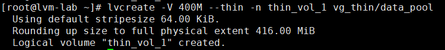
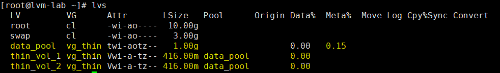
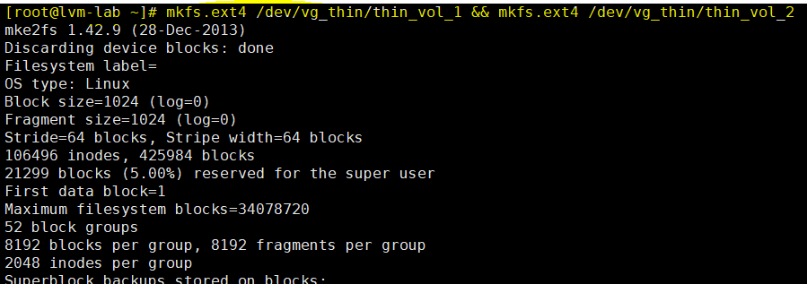
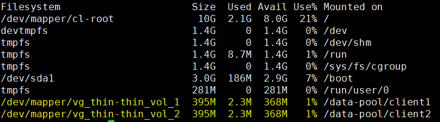
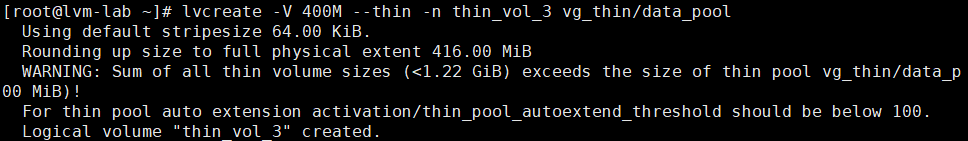
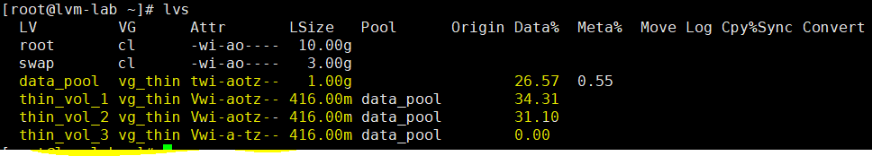

# Thin Provisioning Volume
---
## Giới thiệu
Cung cấp LV động. Tính năng cho phép tạo lv lớn hơn cần thiết mà không lập tức tiêu tốn tài nguyên thực.

Sử thin provisioning, ta có thể quan lý dung lượng còn trống của storage pool (thin pool), cho phép cấp phát tùy ý cho thiết bị khi cần. Có thể tạo ra các thiết bị nằm trong thin pool, sẽ được cấp phát thực sự khi ứng dụng ghi dữ liệu vào LV.

Thin pool có thể mở rộng động, tận dụng tối đa tài nguyên và tối ưu chi phí.

__VD:__
- có 10 user yêu cầu cấp phát 100gb FS cho app của họ.
- Storage administrator có thể tạo 100gb cho từng người ngay cả khi dung lượng thực tế của storage nhỏ hơn.

> Nếu cung cấp Provisioning nhiều hơn dung lượng hiện có, nó gọi là __Over Provisioning.__

### Cấu trúc


## Chuẩn bị
### Thiết lập máy ảo như sau:


## Bắt đầu
### Tạo VG
```
# vgcreate -s 32M vg_thin /dev/sdc1
```
#### Kiểm tra thông số hiện có
```
# pvs
```


### Tạo __Thin Pool__
```
# lvcreate -L 1G --thinpool data_pool vg_thin
```
> -L – Size của volume group

> -–thinpool – Tạo thinpool

> data_pool – Tên Thin pool

> vg_thin – Volume group name sử dụng lưu trữ thinpool



__Kiểm tra thông số thin Pool__
```
# lvs
# lvdisplay vg_thin/data_pool
```


### Tạo Thin Volumes
Tạo __thin volume__ nằm trong __thin pool__
```
# lvcreate -V 500M --thin -n thin_vol_1 vg_thin/data_pool
```


> Tạo tương tự 2 thin volume

__Kiểm tra thông số__
```
# lvs
```


### Tạo File System
#### Tạo thư mục và mount các thin volume
```
# mkdir -p /data-pool/client1 /data-pool/client2
```
#### Định dang FS cho volume
```
mkfs.ext4 /dev/vg_thin/thin_vol_1 && mkfs.ext4 /dev/vg_thin/thin_vol_2
```


#### Mount các volume vừa tạo
```
# mount /dev/vg_thin/thin_vol_1 /data-pool/client1/ && mount /dev/vg_thin/thin_vol_2 /data-pool/client2/
```

#### Kiểm tra thông số vừa tạo
```
df -h
```


#### Tạo dữ liệu test và kiểm tra
```
# lvs
# lvdisplay vg_thin/data_pool
```


> Mỗi ổ có phần trăm sử dụng và giới hạn, tương tự với thin pool

### Over Provisioning
#### Cấp phát thin volume quá giới hạn
```
# lvcreate -V 400M --thin -n thin_vol_3 vg_thin/data_pool
```


> Tổng dung lượng đã vướt quá sức chứa thin pool

#### Kiểm tra thông số cấp phát
Dung lượng chưa được cấp phát khi data chưa được ghi xuống
```
# lvs
```


### Mở rộng logical thin-pool
```
lvextend -L +1G /dev/vg_thin/data_pool
```
> Sử dụng khi VG còn dung lượng hoặc vừa thêm mới các PV
