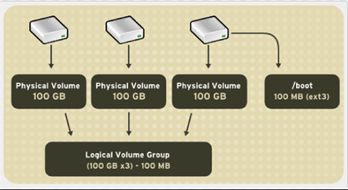
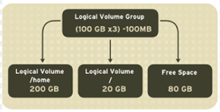
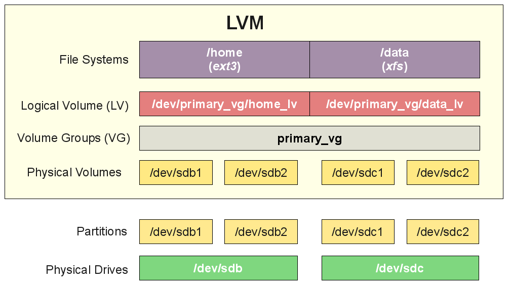

# Tìm hiểu LVM
---
## Giới thiệu
__LVM__ là một phương pháp cho phép ấn định không gian đĩa cứng thành những Logical Volume
=> khiến cho việc thay đổi kích thước trở nên dễ dàng (so với partition)

Có thể thay đổi kích thước mà không cần phải sửa lại partition table của OS. Hữu ích khi sử dụng hết phần bộ nhớ còn trống của partition và muốn mở rộng dung lượng
- => Chỉ cần ấn định lại dung lượng mà không cần phân vùng lại, cũng không phải đối mặt với nguy cơ mất dữ liệu khi thay đổi dung lượng như khi thao tác trên Partition.

## Vai trò của LVM
__LVM__ là kỹ thuật quản lý việc thay đổi kích thước lưu trữ của ổ cứng

__Mục tiêu LVM:__
-	Không để hệ thống bị gián đoạn khi đang hoạt động
-	Không làm lỗi dịch vụ đang chạy
-	Có thể kết hợp Hot Swapping (thao tác thay thế nóng các thành phần bên trong máy tính)

## Một số thuật ngữ trong LVM
__Physical volumes (PV):__
- Đĩa cứng vật lý trong server
- Có thể kết hợp nhiều PV để tạo thành một Volume Groups với dung lượng bằng tổng dung lượng các PV
- PV chỉ là đại diện cho các ổ đĩa vật lý chứ không phải là bản thân ổ đĩa đó, vì vậy để cần phải tạo PV từ các dev đã mount.

__Volume Groups (VG)__

- Một tập hợp các PV, từ VG sẽ có thể phân chia thành các Logical Volumes và các Logical Volumes này có thể thay đổi kích thước dễ dàng.

__Logical Volumes (LV)__

- Đơn vị cuối cùng của hệ thống LVM, các LV tương đương với partition theo cách phân chia truyền thống
- LV có thể thay đổi kích thước dễ dàng, tất cả chỉ phụ thuộc vào kích thước của VG.

__File Systems (FS)__
-	Tổ chức và kiểm soát các tập tin
-	Được lưu trữ trên ổ đĩa cho phép truy cập nhanh chóng và an toàn
-	Sắp xếp dữ liệu trên đĩa cứng máy tính
-	Quản lý vị trí vật lý của mọi thành phần dữ liệu

__Physical Drive__
- Thiết bị lưu trữ dữ liệu, ví dụ như trong linux nó là /dev/sda

__Partition__
- Partitions là các phân vùng của Physical Drive, mỗi Physical Drive có 4 partition, trong đó partition bao gồm 2 loại chính là primary partition và extended partition.

__Mô hình tổng quan__

## Ưu nhược điểm:
__Ưu điểm:__
- Tất cả disk coi như 1
- logical volumes có thể nằm trên nhiều disk
- Tạo các LV, linh động trong việc tăng, giảm
- Thay đổi kích thước LV khi mong muốn, không phụ thuộc vào vị trí LV.
- Resize/create/delete logical trực tiếp, physical volumes online
- Trực tiếp thay đổi trên LV đang sử dụng mà không phải restart
- Cung cấp tính năng snapshots
- Hỗ trợ nhiều loại device-mapper target,

__Nhược điểm__
- Các bước thiết lập phức tạp
- Không thể truy cập LVM từ windows (không hỗ trợ)
