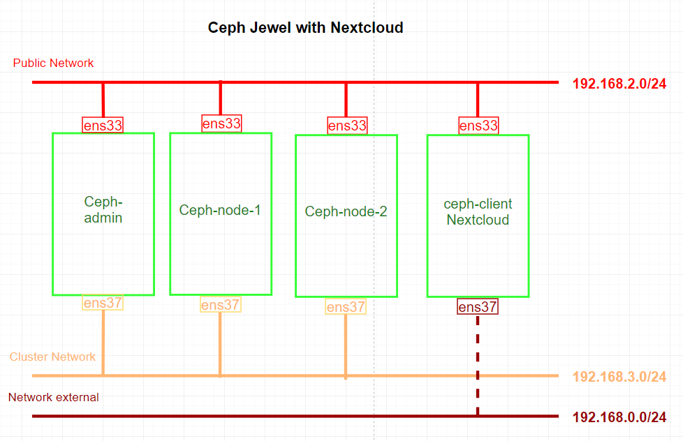

# Kết hợp Ceph Jewel với Nextcloud 13 thông qua Radosgw, S3 interface
---
## Chuẩn bị
### Sơ đồ

### Về tài nguyên

__Chuẩn bị 4 node, chạy CentOS 7 với cấu hình__


## Bắt đầu

### Phần 1: Triển khai Ceph và Nextcloud
> __Quan trọng__, phải lưu ý, thực hiện chính xác

__Cài đặt Ceph__

[Cài đặt Ceph Jewel trên 3 Node](../Ceph/ceph-3node-lab.md)

__Cài đặt Nextcloud__

[Cài đặt Nextcloud 13 trên CentOS 7](../Nextcloud/nc-lab-install.md)

> Cú ý thiết lập IP theo lab hiện tại

### Phần 2: Thiết lập bổ sung trên Ceph Nodes và Nextcloud
#### Bước 1: Bổ sung tại tất cả Ceph node
__Cấu hình file hosts__
```
vim /etc/hosts

# content
192.168.2.133 ceph-admin

192.168.2.134 ceph-node-1

192.168.2.135 ceph-node-2

192.168.2.136 ceph-client # Nextcloud node
```

#### Bước 2: Bổ sung tại Nextcloud node (ceph-client)
> Thực hiện các bước sau trên __ceph-client__

#### Bước 1: Truy cập ceph-client
```
ssh root@ceph-client
```
#### Bước 2: Tạo Ceph User
```
useradd -d /home/cephuser -m cephuser
passwd cephuser
```

Cấp quyền root cho user vừa tạo
```
echo "cephuser ALL = (root) NOPASSWD:ALL" | sudo tee /etc/sudoers.d/cephuser
chmod 0440 /etc/sudoers.d/cephuser
sed -i s'/Defaults requiretty/#Defaults requiretty'/g /etc/sudoers
```

#### Bước 3: Cấu hình NTP
Sử dụng NTP đồng bộ thời gian trên tất cả các Node.
> Ở đây sử dụng NTP pool US.

```
yum install -y ntp ntpdate ntp-doc
ntpdate 0.us.pool.ntp.org
hwclock --systohc
systemctl enable ntpd.service
systemctl start ntpd.service
```
#### Bước 4 (Tùy chọn): Nếu chạy tất cả node trên VMware, cần sử dụng công cụ hỗ trợ
```
yum install -y open-vm-tools
```

#### Bước 5: Hủy bỏ SELinux
```
sed -i 's/SELINUX=enforcing/SELINUX=disabled/g' /etc/selinux/config
```
#### Bước 6: Cấu hình Firewalld
Hủy bỏ thiêt lập firewalld
```
systemctl stop firewalld
systemctl disable firewalld
```

### Phần 3: Thiết lập bổ sung trên ceph-admin
> Thực hiện các bước sau trên __ceph-admin__

#### Bước 1: Truy cập ceph-admin
```
ssh root@ceph-admin
```
#### Bước 2: Bổ sung cấu hình ssh file
Chỉnh sửa cấu hình ssh
```
vim ~/.ssh/config
```

Nội dung cập nhật

```
Host ceph-admin
        Hostname ceph-admin
        User cephuser

Host ceph-node-1
        Hostname ceph-node-1
        User cephuser

Host ceph-node-2
        Hostname ceph-node-2
        User cephuser

Host ceph-client
        Hostname ceph-client
        User cephuser
```
Chuyển ssh-key tới node ceph-client
```
ssh-keyscan ceph-client >> ~/.ssh/known_hosts
ssh-copy-id ceph-client
```
> Yều cầu nhập passwd trong lần đầu tiền truy cập

### Phần 4: Thiết lập bổ sung Ceph Cluster
> Thực hiện các bước sau trên __ceph-admin__

Truy cập Cluster directory (Có được khi cài đặt Ceph)
```
cd cluster/
```
Triển khai Ceph trên ceph-client (Nextcloud node)
```
ceph-deploy install ceph-client
```
Thiết lập management-key
```
ceph-deploy admin ceph-client
```

### Phần 5: Thiết lập kết nối Nextcloud với Ceph thông qua Radosgw, S3 interface
#### Bước 1: Thiết lập trên ceph-admin
> Thực hiện trên __ceph-admin__

Truy cập ceph-admin
```
ssh root@ceph-admin
```
Truy cập ceph cluster directory
```
cd cluster/
```
Tạo 2 rados gateway:
- 1 trên ceph-node-1
- 1 trên ceph-node-2

```
ceph-deploy rgw create ceph-node-1 ceph-node-2
```
> API gateways chạy trên port 7480.

> Sử dụng 2 gateway trong trường hợp cần tới HA, load balancing

Tạo user cho S3 interface, user được phép sử dụng service.
```
radosgw-admin user create --uid="nextclouds3" --display-name="Nextcloud S3 User"
radosgw-admin quota set --quota-scope=user --uid="nextclouds3" --max-objects=-1 --max-size=20G
```
> User ở đây chính là Nextcloud server

Kiểm tra user __nextclouds3__
```
[root@ceph-admin ~]# radosgw-admin user info --uid=nextclouds3
{
    "user_id": "nextclouds3",
    "display_name": "Nextcloud S3 User",
    "email": "",
    "suspended": 0,
    "max_buckets": 1000,
    "auid": 0,
    "subusers": [],
    "keys": [
        {
            "user": "nextclouds3",
            "access_key": "VJRQ3C2RHWJ1T91BSD5B",
            "secret_key": "APyIJpxRci3ETojXWz4fEIOiJMMMifYftFRK0JUM"
        }
    ],
    "swift_keys": [],
    "caps": [],
    "op_mask": "read, write, delete",
    "default_placement": "",
    "placement_tags": [],
    "bucket_quota": {
        "enabled": false,
        "max_size_kb": -1,
        "max_objects": -1
    },
    "user_quota": {
        "enabled": false,
        "max_size_kb": 20971520,
        "max_objects": -1
    },
    "temp_url_keys": []
}
```


#### Bước 2: Kiểm tra thiết lập radosgw sử dụng cho Nextcloud server
> Thực hiện trên ceph-admin (có thể trên ceph-client)

Trước khi cầu hình Nextcloud sử dụng CEPH-S3, ta cần kiểm tra ceph-node-1 radosgw có cho phép sử dụng service

__Cài đặt gói__
```
yum -y install python-boto
```
Tạo python script "/root/cephs3test.py"
```
[root@ceph-admin ~]# vim cephs3test.py3

# content
import boto
import boto.s3.connection

access_key = 'VJRQ3C2RHWJ1T91BSD5B'
secret_key = 'APyIJpxRci3ETojXWz4fEIOiJMMMifYftFRK0JUM'
conn = boto.connect_s3(
   aws_access_key_id = access_key,
   aws_secret_access_key = secret_key,
   host = 'ceph-node-1', port = 7480,is_secure=False, calling_format = boto.s3.connection.OrdinaryCallingFormat(),)

bucket = conn.create_bucket('my-new-bucket')
for bucket in conn.get_all_buckets():
   print "{name} {created}".format(name = bucket.name,created = bucket.creation_date,)
```
Chạy script
```
python /root/cephs3test.py
```
Kết quả sẽ gần giống
```
my-new-bucket 2018-02-27T04:56:33.729Z
nextcloud 2018-02-27T04:48:46.508Z
```

Kiểm tra bằng node ceph-admin
```
[root@ceph-admin ~]# radosgw-admin bucket list
[
    "my-new-bucket",
    "nextcloud"
]
```
Xóa bucket test
```
radosgw-admin bucket rm my-new-bucket
```
#### Bước 3: Thiết lập trên ceph-client (Nextcloud node)
> Thực hiện trên ceph-client

__Kiểm tra thông tin user s3 vừa tạo__
```
[root@nextcloud ~]# radosgw-admin user info --uid=nextclouds3
{
    "user_id": "nextclouds3",
    "display_name": "Nextcloud S3 User",
    "email": "",
    "suspended": 0,
    "max_buckets": 1000,
    "auid": 0,
    "subusers": [],
    "keys": [
        {
            "user": "nextclouds3",
            "access_key": "VJRQ3C2RHWJ1T91BSD5B",
            "secret_key": "APyIJpxRci3ETojXWz4fEIOiJMMMifYftFRK0JUM"
        }
    ],
    "swift_keys": [],
    "caps": [],
    "op_mask": "read, write, delete",
    "default_placement": "",
    "placement_tags": [],
    "bucket_quota": {
        "enabled": false,
        "max_size_kb": -1,
        "max_objects": -1
    },
    "user_quota": {
        "enabled": false,
        "max_size_kb": 20971520,
        "max_objects": -1
    },
    "temp_url_keys": []
}
```
> Chú ý: Sử dụng các key sau

> Access key: VJRQ3C2RHWJ1T91BSD5B

> Secret key: APyIJpxRci3ETojXWz4fEIOiJMMMifYftFRK0JUM

__Cấu hình tích hợp Ceph-S3 với Nextcloud__

> Cấu hình tại đường dẫn file config Nextcloud __"/var/www/html/nextcloud/config/config.php"__

Cấu hình thêm vào
```
'objectstore' =>
array (
  'class' => 'OC\\Files\\ObjectStore\\S3',
  'arguments' =>
  array (
    'bucket' => 'nextcloud',
    'autocreate' => true,
    'key' => 'VJRQ3C2RHWJ1T91BSD5B',
    'secret' => 'APyIJpxRci3ETojXWz4fEIOiJMMMifYftFRK0JUM',
    'hostname' => '192.168.2.134',
    'port' => 7480,
    'use_ssl' => false,
    'region' => 'optional',
    'use_path_style' => true,
  ),
),
```
Cấu hình tổng quát sau khi thay đổi
```
[root@nextcloud ~]# vim /var/www/html/nextcloud/config/config.php

<?php
$CONFIG = array (
  'instanceid' => 'ocxp066aqfnv',
  'passwordsalt' => '0vAbZpW/j3bEMfrzGOEZRjhZ7VNz6E',
  'secret' => 'bftvAR7dHORy5//tqVC5i4mVDwAMgqw+nDtQG5s0fARbF5rW',
  'trusted_domains' =>
  array (
    0 => '192.168.2.136',
    1 => '192.168.0.104',
  ),
  'datadirectory' => '/var/www/html/nextcloud/data',
  'objectstore' =>
  array (
    'class' => 'OC\\Files\\ObjectStore\\S3',
    'arguments' =>
    array (
      'bucket' => 'nextcloud',
      'autocreate' => true,
      'key' => 'VJRQ3C2RHWJ1T91BSD5B',
      'secret' => 'APyIJpxRci3ETojXWz4fEIOiJMMMifYftFRK0JUM',
      'hostname' => '192.168.2.134',
      'port' => 7480,
      'use_ssl' => false,
      'region' => 'optional',
      'use_path_style' => true,
    ),
  ),
  'overwrite.cli.url' => 'http://192.168.2.136/nextcloud',
  'dbtype' => 'mysql',
  'version' => '13.0.0.14',
  'dbname' => 'nextcloud',
  'dbhost' => 'localhost',
  'dbport' => '',
  'dbtableprefix' => 'oc_',
  'dbuser' => 'nc_user',
  'dbpassword' => 'thanh123',
  'installed' => true,
);
```

__Khởi động lại apache__
```
systemctl restart httpd
```

###  Phần 6: Kiểm tra lại các thiết lập giữa Ceph và Nextcloud

#### Kiểm tra bucket sử dụng cho nextcloud
```
[root@nextcloud ~]# radosgw-admin bucket stats --bucket=nextcloud
{
    "bucket": "nextcloud",
    "pool": "default.rgw.buckets.data",
    "index_pool": "default.rgw.buckets.index",
    "id": "e4391e3d-1578-4ca7-a07f-14f13e0fa7b2.14101.1",
    "marker": "e4391e3d-1578-4ca7-a07f-14f13e0fa7b2.14101.1",
    "owner": "nextclouds3",
    "ver": "0#1383",
    "master_ver": "0#0",
    "mtime": "2018-02-26 23:48:46.508126",
    "max_marker": "0#",
    "usage": {
        "rgw.main": {
            "size_kb": 593094,
            "size_kb_actual": 593444,
            "num_objects": 141
        }
    },
    "bucket_quota": {
        "enabled": false,
        "max_size_kb": -1,
        "max_objects": -1
    }
}
```

#### Kiểm tra list obj trong bucket
```
[root@nextcloud ~]# radosgw-admin bucket list --bucket=nextcloud
```
#### Dung lượng
__Upload data lên Nextcloud, dung lượng Ceph sẽ thay đổi__
```
[root@nextcloud ~]# ceph -s
    cluster 60643eb6-a568-42ae-b665-114807627e09
     health HEALTH_OK
     monmap e1: 3 mons at {ceph-admin=192.168.2.133:6789/0,ceph-node-1=192.168.2.134:6789/0,ceph-node-2=192.168.2.135:6789/0}
            election epoch 10, quorum 0,1,2 ceph-admin,ceph-node-1,ceph-node-2
     osdmap e41: 2 osds: 2 up, 2 in
            flags sortbitwise,require_jewel_osds
      pgmap v621: 316 pgs, 11 pools, 831 MB data, 556 objects
            1740 MB used, 28957 MB / 30697 MB avail # Dung lượng thay đổi
                 316 active+clean
```
