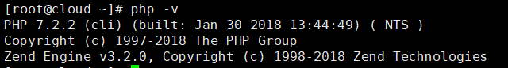
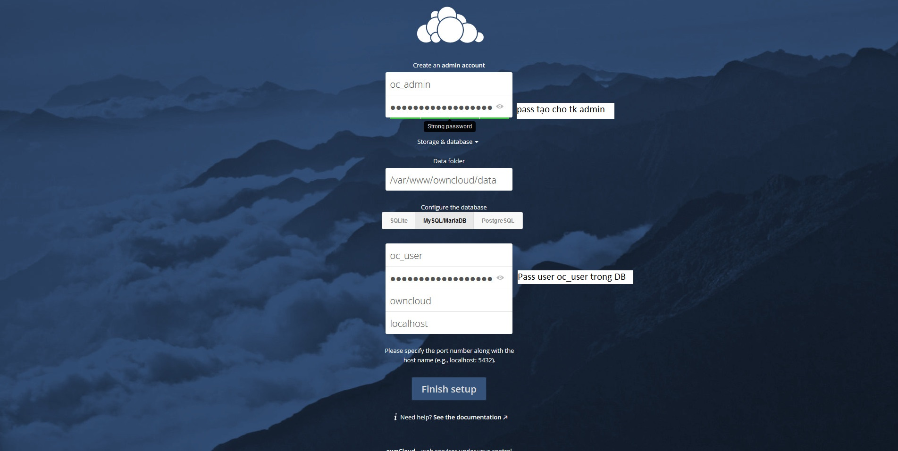
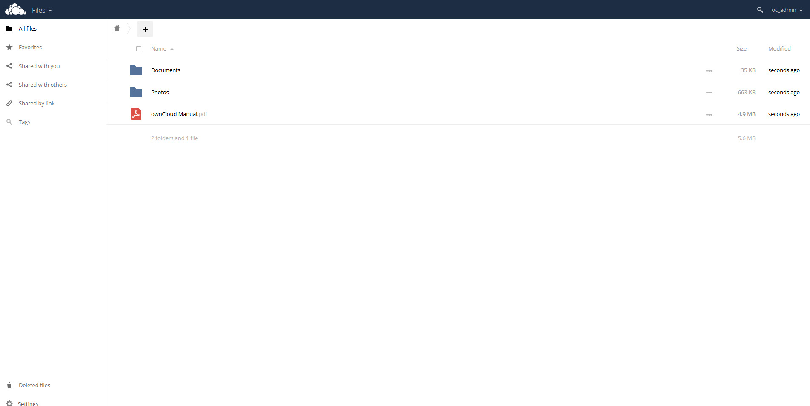

# Cài đặt Owncloud 10 trên CentOS 7
---
## Chuẩn bị
Chuẩn bị 1 node, chạy CentOS 7 với cấu hình
```
CPU:       2 core
RAM:       2 gb
HDD:       50 gb
Network:   ens33 - 192.168.2.142 (NAT Card)
```

## Cài đặt
### Phần 1: Cài đặt Php 7.2.x
#### Bước 1: Cài đặt repo EPEL và REMO trong CentOS 7
```
# yum install https://dl.fedoraproject.org/pub/epel/epel-release-latest-7.noarch.rpm -y
# yum install http://rpms.remirepo.net/enterprise/remi-release-7.rpm -y
```
#### Bước 2: Cài đặt yum-utils
```
# yum install yum-utils -y
```
Sử dụng yum-config-manager (có được sau khi càu yum-utils), lựa chọn phiên bản Remi php 7.2 (phiên bản sau khi cài 7.2.2)
```
# yum-config-manager --enable remi-php72   [Install PHP 7.2]
```
#### Bước 3: Cài đặt php 7 và các package hỗ trợ
```
# yum install php php-mbstring php-pdo php-json php-pear php-mbstring php-dom php-xml php-mcrypt php-cli php-gd php-curl php-mysql php-ldap php-zip php-fileinfo php-intl -y
```
Kiểm tra phiên bản sau khi cài
```
php -v
```


### Phần 2: Cài đặt thiết lập Maria DB
#### Bước 1: Cài đặt Maria DB
```
# yum install mariadb-server
```
Chạy Database
```
# systemctl start mariadb
# systemctl enable mariadb
```
#### Bước 2: Thiết lập root passwd
```
# mysql_secure_installation
```
> Cài đặt root passwd (đọc theo hướng dẫn), nên lưu passwd dùng cho các phần sau

#### Bước 3: Cấu hình Mariadb
Truy cập Mariadb
```
# mysql -u root -p
```
Tại màn hình CMD:
```
CREATE DATABASE owncloud;
CREATE USER 'oc_user'@'localhost' IDENTIFIED BY 'NHẬP_PASS_TẬI_ĐÂY';
GRANT ALL PRIVILEGES ON owncloud.* TO 'oc_user'@'localhost';
FLUSH PRIVILEGES;
```
> Lưu passwd của db vừa tạo, sử dụng cho phần Sau

### Phần 3: Cài đặt Owncloud
#### Bước 1: Thiết lập gói
```
# rpm --import https://download.owncloud.org/download/repositories/10.0/CentOS_7/repodata/repomd.xml.key
# curl https://download.owncloud.org/download/repositories/10.0/CentOS_7/ce:10.0.repo | tee /etc/yum.repos.d/owncloud_CE:10.0.repo
```
#### Bước 2: Cài đặt gói Owncloud
```
# yum install owncloud
```
### Phần 4: Cầu hình apache và SELinux, Firewalld
#### Bước 1: Cấu hình SELinux
Tắt SELinux
```
sed -i 's/SELINUX=enforcing/SELINUX=disabled/g' /etc/selinux/config
```
#### Bước 2: Cấu hình Apache service
Chạy Apache service
```
# systemctl start httpd
# systemctl enable httpd
```

#### Bước 3: Cấu hình Firewalld
__Tùy chọn 1:__

Tắt firewall
```
# systemctl stop firewalld
# systemctl disable firewalld
```
__Tùy chọn 2:__

Cấu hình mở port Http và Https
```
# firewall-cmd --add-service http --permanent
# firewall-cmd --add-service https --permanent
# firewall-cmd --reload
```

### Phần 5: Thiết lập Owncloud
#### Thiết lập Owncloud Web

```
Truy cập  "http://192.168.2.142/owncloud/"
```
__Giao diện cấu hình__



__Sau khi cầu hình thành công__



## Nguồn
https://www.marksei.com/install-owncloud-10-server-centos/

https://www.tecmint.com/install-php-7-in-centos-7/
